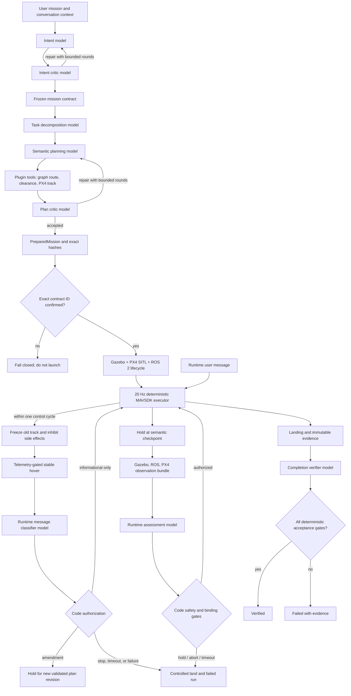

# Architecture and authority boundaries

## Design objective

The core turns an open-ended natural-language mission into a bounded, reviewable,
executable mission for the real DroneDream simulation stack. A model contributes
reasoning at several narrow stages; it does not replace flight control, geometry,
runtime binding, or the safety supervisor.

## Authority layers

| Layer | May do | May not do |
|---|---|---|
| Model roles | Interpret intent, decompose tasks, critique plans, assess checkpoint observations, review completion evidence | Arm, command motors, change coordinate frames, waive deterministic gates |
| Plugin tools | Read qualified assets, compute routes, check clearance, create typed PX4 tracks, emit receipts | Obtain actuator authority or silently mutate source assets |
| Orchestrator | Run bounded model loops, freeze the mission contract, bind artifacts, require confirmation | Continue after exhausted rounds or invalid structured output |
| Checkpoint coordinator | Ask the runtime model for a typed decision while the aircraft holds | Authorize a mismatched checkpoint, moving aircraft, low battery, collision, or timeout |
| Runtime interruption coordinator | Classify a bound user message after stable-hold evidence exists | Advance the old plan, issue coordinates, or authorize a failed hold |
| PX4 executor | Stream validated NED position targets at 20 Hz, hold, land on completion or failure | Invent a route or reinterpret natural language |
| Safety and acceptance code | Stop execution, land, validate hashes/timing/goal/landing/process state | Be relaxed by model output |

## Model-call topology

The nominal mission uses five planning calls: intent, intent critique, task graph,
semantic plan, and plan critique. Either critique can create another bounded proposal
round. During execution, one runtime assessment call occurs at each semantic movement
checkpoint while the executor holds the latest setpoint. One final call reviews the
collected evidence; code still makes the final verified/failed decision.

The verified campus-gate run therefore used ten calls: five planning calls, four live
checkpoint calls, and one completion call. The topology is data-driven: a different
mission can produce a different task graph and checkpoint count.

A message submitted during execution is a separate event within the same task thread.
Deterministic code claims it at the next 20 Hz poll, disables old-plan advancement and
semantic side effects, and stabilizes a current-position hold before the classifier call.
The measured `runtime-interrupt-r3` provider latency was 28.272 seconds; the vehicle held
through that entire interval. Emergency wording forces landing even if a model were to
misclassify it. Destination, payload, route, or speed changes force a new plan revision
  and can never resume the old track. A destination amendment is grounded against the
  selected map, routed from the telemetry-confirmed hold position through the new target to
  the original return node, continuously checked against the vehicle envelope, and adopted
  only through a hash-bound replacement-track handshake.

## Control separation

`RuntimeCheckpointDecision.action == "accept"` is necessary but insufficient to resume.
The coordinator also checks all of the following from observed data and frozen bindings:

- contract ID, segment ID, checkpoint ID, and expected route index match;
- observed ENU position is within the checkpoint tolerance;
- speed is below the stable-hold limit;
- battery, collision, route-deviation, runtime, and observation-age limits pass;
- model response arrives before the bounded deadline;
- the response does not request an unknown or out-of-scope operation.

If any check fails, the executor never advances to the next segment. It holds only for
the bounded decision interval, then follows the configured controlled-landing exit.

## Context and structured boundaries

Conversation history is retained as typed events. Before a provider call, older content
can be compacted into a bounded structured summary while the active mission contract,
current plan, tool receipts, errors, and latest observations remain explicit. Provider
outputs are parsed directly into Pydantic models; a JSON-shaped string is not treated as
valid merely because it parses.

Generated JSON Schemas under `schemas/` are the integration boundary for future ROS,
service, and product-shell consumers. Change a contract deliberately, regenerate the
schemas, and review both the Python diff and Schema diff.

`conversation_id` identifies the user-visible task, and its random `mission_id` remains
stable across preflight edits. Each accepted replacement receives a new `plan_revision_id`;
each launch receives a new `execution_id`; each message receives a new `message_id`.
SQLite `BEGIN IMMEDIATE` transitions prevent an active execution from accepting a
preflight revision. Runtime inbox messages must match all four identities before they are
allowed to affect control state.

## Failure and safety exits

- Provider authentication, timeout, malformed output, or exhausted repair rounds:
  planning fails and execution is not launched.
- Asset/hash mismatch or missing explicit contract confirmation: execution is not launched.
- PX4/Gazebo/ROS process startup failure or premature exit: the run fails.
- Checkpoint timeout, model hold/abort, coordinate mismatch, motion, collision, low battery,
  route deviation, or stale observation: stop advancing and land.
- Runtime-message identity mismatch, unstable hold, classifier failure, decision timeout,
  or missing replacement track after a bounded amendment hold: controlled landing.
- Goal, landing, ULog, timing, process-cleanup, or evidence-chain failure: never label the
  run verified, even if the vehicle appeared to reach the destination.

## Public integration boundary

This component is the public autonomy Harness shared by all five DroneDream products.
The public repository remains the product, qualified simulation-asset, distribution,
and release authority. Ongoing private incubation may advance independently, but only
reviewed commits with reproducible tests and end-to-end evidence are promoted here.
