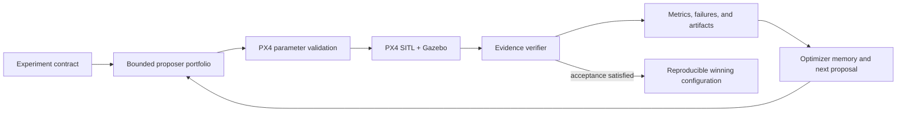

# DroneDream Harness Engineering

DroneDream is not a replacement flight simulator. PX4 SITL and Gazebo remain
the flight-control and physics engines. DroneDream adds a reproducible harness
around them so a user can define an experiment once and let the system propose,
execute, verify, compare, and learn from many bounded trials.



## Product boundary

- PX4 owns flight-control firmware, parameters, failsafes, and SITL behavior.
- Gazebo owns the simulated world, vehicle dynamics, sensors, entities, and
  physics plugins.
- DroneDream owns experiment orchestration, parameter safety bounds, candidate
  generation, trial isolation, evidence validation, comparison, recovery,
  reporting, and human-facing workflow.
- An input field is not proof that an effect happened. A trial may claim an
  advanced physical effect only when the launcher returns validated evidence
  tied to the exact request, execution identity, and applied mechanism.

## Scenario-effect contract

Every physical scenario request is normalized into
`dronedream.scenario_effect_request.v1`. The launcher returns
`dronedream.scenario_effect_evidence.v1`. The outer runner verifies:

1. request SHA-256 and schema version;
2. job, trial, and execution identity;
3. one result for every requested effect;
4. the named application mechanism and its read-back evidence;
5. no unsupported or unverified effect before a trial can pass.

This contract lets future Runtime adapters add PX4/Gazebo functionality without
weakening the result semantics.

## Current physical capability matrix

| Effect | Current bundled Runtime status | Required proof |
| --- | --- | --- |
| Static box/cylinder obstacles | Implemented in bundled runner source; released-Runtime acceptance pending | Gazebo EntityFactory returns `data: true`; evidence stores entity name, service, source index, and generated SDF hash |
| Wind vector and periodic gusts | Runtime extension required | Generated world/plugin configuration plus observed Gazebo wind state |
| GPS, barometer, and IMU noise | Runtime extension required | Generated sensor SDF plus model/sensor identity and effective noise configuration |
| GPS dropout/failure schedule | Runtime extension required | PX4 failure command/event timeline plus observed estimator/sensor state |
| Battery degradation | Runtime extension required | Applied PX4 battery simulation settings and read-back telemetry |
| Payload mass/inertia | Runtime extension required | Generated model/inertial definition and Gazebo entity read-back |
| Actuator delay/failure | Runtime extension required | Supported PX4/Gazebo injection mechanism and timestamped response evidence |

“Runtime extension required” is deliberate: the desktop UI can collect and
validate the scenario, but the real runner refuses to label it as physically
applied until the dedicated Runtime contains a verified adapter.

## Expansion order

1. Add deterministic wind world generation and a wind-observation smoke gate.
2. Add per-trial sensor model generation for GPS, barometer, and IMU noise.
3. Add PX4-supported failure injection with an explicit event scheduler.
4. Add battery and payload model adapters with telemetry/read-back checks.
5. Add actuator fault adapters only for mechanisms supported by the pinned PX4
   and Gazebo versions.
6. Rebuild, smoke-test, sign, and release `DroneDreamRuntime`; source changes do
   not become customer capabilities until this release gate passes.

## Safety and reproducibility rules

- Never mutate the user's personal Ubuntu distribution; the desktop installer
  operates only on the dedicated `DroneDreamRuntime` WSL distribution.
- Pin PX4, Gazebo, Python dependencies, and Runtime manifests.
- Keep every proposal inside catalog and user-defined bounds.
- Preserve requested parameters, applied parameter read-back, scenario-effect
  request/evidence, telemetry, logs, metrics, and failure taxonomy per trial.
- Treat simulation winners as candidates for controlled validation, not proof
  of safety on a real aircraft.

## Bounded model decision context

The optional `llm_harness` mode does not give a model direct simulator or
parameter authority. At each generation boundary, deterministic code compiles a
versioned evidence snapshot containing remaining budget, scenario cost, search
progress, stagnation, feasibility/failure statistics, and bounded per-tool
history. It also receives a bounded, enum-only memory of recent tool dispatch
outcomes, allowing a later generation to react when a prior tool exhausted its
search space or dispatched no candidates. The model may select one identifier
from the closed optimizer registry; the server validates that identifier and
remains the only dispatcher. The dispatcher skips the model entirely when no
generation or Trial budget remains, so an impossible plan cannot consume
provider quota before deterministic rejection.
The displayed full-Candidate Trial cost and remaining full-Candidate capacity
come from the same validated scenario-matrix compiler used by dispatch, including
enabled training and holdout seed rows rather than the legacy Job default.

Every provider-call start event stores the bounded safe evidence snapshot and
static tool manifest with evidence, manifest, and full-prompt SHA-256 values plus
explicit prompt/trace versions. A pure verifier rebuilds the production messages
and detects snapshot, manifest, or prompt drift. This is a reproducibility check,
not a cryptographic signature or an immutable audit ledger.
Exported decision-start events can be checked without database or provider access:

```powershell
cd backend
python -m scripts.verify_harness_decision_traces .\decision-events.jsonl
```

The verifier accepts a raw payload, a JSON array, or JSONL event export; ignores
unrelated event envelopes; emits only bounded identifiers, failure codes, and
computed hashes; and exits nonzero if no decision trace is present or any trace
fails current-version reconstruction.

Provider-visible evidence never includes user labels, candidate IDs, parameter
values, scenario IDs or seeds, free-form simulator/model text, credentials, or
arbitrary JSON. Mixed numeric/text metric arrays are rejected as a whole rather
than letting untrusted text affect the visible array shape. The snapshot keeps
the baseline, strongest measured candidates, and latest generations so historical
quality does not hide recent stagnation.
Long Jobs retain full-history stagnation computation while exposing only the first
and latest 31 generation-best points, preventing unbounded prompt growth. Tests
verify byte-for-byte prompt invariance under untrusted-field mutations and keep a
synthetic 1,001-Candidate history below the minimum configured 32 KiB prompt limit.
The router sees trusted training completion/failure/pass rates, feasibility
coverage, invalid/cancelled Trial counts, scalar loss, and best-to-runner-up score
gaps. Holdout status and values remain sealed from every adaptive decision so the
validation set cannot become another training signal.

The compatibility `gpt` parameter proposer follows the same validation firewall in
Prompt Schema 2.0. It receives allowlisted training scenario structure and numeric
inputs, while holdout types/IDs/seeds/configuration/results, Candidate labels/IDs,
arbitrary metric keys, and unknown failure strings are removed. This path still has
more authority than the closed-tool Harness and is not the preferred control plane.

## Versioned outcome and selection semantics

Every new or rerun Job now compiles
`dronedream.optimization-outcome/v1` before dispatch. The content-addressed
contract binds the objective/constraint configuration, enabled training and
holdout scenario identities, seed rows, case weights, acceptance thresholds,
metric sources/units, missing-metric treatment, failure treatment, and final
promotion rules. The same contract is persisted as a Job event, copied into the
reproducibility manifest, and referenced by every advanced Candidate aggregate.
Recognized pre-contract scenario aliases are normalized only for legacy export,
while the contract retains the original persisted-suite hash and records the
named compatibility transformation.
Final aggregation recompiles the contract and fails closed with
`OUTCOME_CONTRACT_DRIFT` if a recorded new-Job contract no longer matches the
persisted Job configuration.

Candidate selection uses Selection Key 1.0 with explicit lexicographic
precedence: complete evidence, hard feasibility, hard-constraint violation,
training failure rate, preference plus soft-constraint loss, then a stable
tiebreak. Hard constraints are no longer folded into `scalar_loss` and are no
longer represented by a `1,000,000` magic penalty. Soft constraints remain a
declared loss term; failed Trials remain a separately weighted rate. The
optimizer-learning reliability boundary (`failure_rate < 0.5`) is a named
constant sealed into the contract, and multiple bounds on one metric retain
separate constraint IDs instead of overwriting one observation. Traditional
CMA centering, public ranking, experimental optimizer observations, and reports
therefore consume compatible meanings instead of silently double-counting hard
feasibility.

Outcome Contract compiler 1.1 also fixes the objective representation used by
each numerical call. A Bayesian multi-objective call uses a complete joint
objective vector when one exists and otherwise falls back to declared scalar
loss; it never blends both. TuRBO and CMA-family scalar-state optimizers use
scalar loss only. Proposal metadata records the selected representation so the
decision can be replayed and audited.

Outcome Contract compiler 1.2 makes the scenario estimand hierarchical. Usable
replicates first pass through the declared within-case estimator (mean, worst,
CVaR, or percentile); the resulting case value then receives the case's full
frozen weight in the declared across-suite estimator. A failed replicate
therefore affects the separately modeled failure rate without silently
shrinking that scenario's objective weight. A dispatched case with no usable
metric produces no scalar objective, while constraints continue to inspect the
worst usable seed rather than a potentially safer case aggregate.

Outcome Contract compiler 1.3 freezes final-promotion projection semantics.
Acceptance RMSE is an unrounded within-case mean followed by the fixed
case-weighted mean, maximum error is the unrounded worst usable seed, and pass
rate uses every dispatched seed in each case denominator before case weights.
The evaluator consumes these versioned decision fields rather than rounded
display values.

Outcome Contract compiler 1.4 admits registered metrics only. Numeric keys in
adapter `raw_metric_json` remain report evidence until a reviewed registry
entry binds their source, unit, value kind, and semantics. Job creation,
reruns, and batch children reject unregistered objective or constraint names
with `INVALID_OUTCOME_CONTRACT` before a Job row or secret is persisted.

Outcome Contract compiler 1.5 records known metric dependencies and rejects
objective duplication before execution. The adapter-defined composite `score`
cannot be combined with another objective until its component graph is
registered, and `completion_rate`, `failure_rate`, and `failed_trial_rate`
cannot be combined as if they were independent reliability objectives or
constraints.

Outcome Contract compiler 1.6 freezes Bayesian preference inputs at the Job
boundary. Vector acquisition uses the configured objective weights and
normalization scales rather than observed extrema or per-call random
scalarizations. The optimizer request requires weights and scales to name the
same metrics, and an incomplete observed objective vector falls back to the
declared scalar loss (or exploration when no scalar evidence exists) rather
than silently optimizing a reduced problem. Proposal metadata records the
preference policy, weights, and scales used.

Outcome Contract compiler 1.7 adds a migration-safe
`CandidateOutcomeEvidenceV1` compatibility projection. New aggregates bind
the search-role objectives, constraints, selection key, acceptance fields,
candidate parameters, holdout projection, and exact Trial evidence snapshot
to a canonical SHA-256 identifier. Ranking, acceptance, publishability, and
optimizer learning read the verified projection when present and fail closed
on schema, hash, or bound-holdout mismatch. The payload is still embedded in
the legacy aggregate JSON; an append-only relational evidence ledger remains
a later database migration rather than a capability claimed by this slice.

Outcome Contract compiler 1.8 makes reduced-fidelity scenario coverage
case-stratified by contract. A screening matrix must execute at least one
replicate from every configured training case before allocating additional
replicates. The effective fidelity advertised to the numerical optimizer is
the actual executed fraction after this minimum is applied, so a small nominal
budget cannot silently omit difficult cases or claim less work than it ran.
Holdout cases remain reserved for full verification.

Outcome Contract compiler 1.9 defines
`dronedream.trial-outcome-taxonomy/v1`. Timeout, simulator failure, and
unstable-controller outcomes remain physical/domain failures; adapter,
simulator-process, artifact, and result-persistence failures are
infrastructure outcomes; cancellation and invalid evidence remain separate.
Only domain failures plus unknown failures enter the optimizer-learning
failure rate, with unknown codes treated conservatively. Every non-success
still remains in acceptance/completion denominators, blocks complete evidence,
and retains its incurred work; infrastructure exclusion never turns a failed
run into a passing result.

Outcome Contract compiler 2.0 adds
`dronedream.portfolio-sources/v1` for same-batch proposal attribution. An exact
parameter/fidelity action proposed by multiple child optimizers retains every
unique child source and divides reward credit so shares sum to one. Same-tool
duplicates cannot multiply credit. A lower-fidelity collision or a source
superseded by a higher-fidelity action remains visible but becomes reward
ineligible; emergency fallbacks remain ineligible. Portfolio statistics use
fractional credit rather than awarding one full reward to every source. This
does not yet replace the need for an append-only routing-opportunity/action
ledger capable of preserving collisions against historical Candidates.

Outcome Contract compiler 2.1 freezes the online portfolio reward definition.
Each child is credited only for reducing the globally comparable full-fidelity
incumbent that existed before its generation began. Reward uses one fixed
normalized preference-loss unit, is bounded to `[0, 1]`, applies exact-source
shares, and records at most the best attributed reward once per child per
generation. Later tools cannot claim improvement over an obsolete baseline,
same-generation batch size cannot add rewards together, and observed extrema
cannot rescale historical credit. Cost, delay, action probability, and
append-only reward events remain outside this compatibility slice.

Outcome Contract compiler 2.2 closes the Candidate-context replay boundary.
When a Candidate carries required outcome evidence, acceptance, publishability,
and optimizer-learning readers now verify that the evidence's Candidate ID,
generation index, and parameter SHA-256 still match the current Candidate row.
A copied evidence envelope, changed generation, non-canonical parameter
snapshot, or post-aggregation parameter mutation produces no authoritative
projection and fails closed. The embedded evidence still needs a future
append-only relational ledger and current Trial-row re-verification.

Outcome Contract compiler 2.3 closes that remaining Trial-row gap. The canonical
training Trial snapshot—Trial ID, status, seed, scenario identity/config,
failure code, and accepted metric fields—is compiled in one shared function,
sorted deterministically, and re-hashed at acceptance, publishability, and
optimizer-learning reads. A post-aggregation status, scenario, failure, or
metric edit makes the Candidate evidence non-authoritative. Holdout Trial rows
remain covered by the separately bound holdout projection; artifact bytes and
physical-attempt lineage still require the future relational evidence ledger.

Outcome Contract compiler 2.4 adds
`dronedream.candidate-report-evidence/v1`. Final-display RMSE, mean/worst
maximum error, overshoot count, completion time, score, and reliability rates
are content-addressed and linked to the verified Candidate outcome-evidence
ID. A second hash binds every current Candidate Trial row, including holdout
rows, without exposing holdout results to adaptive optimization. JobReport,
real-runtime candidate summaries, reproducibility manifests, and PDF reports
read this verified projection; mutable compatibility fields beside it cannot
change the report, while a changed Candidate, Trial, projection, or hash fails
closed. Legacy aggregates remain readable. The evidence is still embedded in
aggregate JSON, so immutable physical-attempt rows, artifact digests, and a
relational evidence ledger remain future work.

Outcome Contract compiler 2.5 adds
`dronedream.winner-selection-evidence/v1`. Finalization records the complete
aggregated Candidate universe, each Candidate's outcome/report evidence IDs,
publishability disposition, Selection Key 1.0 tuple, deterministic rank, and
the stable optimizer-before-baseline/generation/ID tie-break. The envelope is
content-addressed and is reverified against current Candidate rows, Trial-bound
projections, ranks, baseline, and selected winner before any modern report is
published. JobReport, completion events, real-runtime report JSON,
reproducibility manifests, and PDF reports carry the resulting evidence or its
ID. Modern evidence-bound jobs fail closed when the envelope is missing or
diverges; legacy reports remain readable without manufacturing historical
proof. This proves the current deterministic selection over the persisted
Candidate set, but it is not yet the future atomic winner-freeze ledger or
sealed final-test boundary.

Outcome Contract compiler 2.6 adds
`dronedream.winner-freeze-receipt/v1`. Modern finalization inserts exactly one
receipt per Job while the Job holds `FINALIZING`; database uniqueness covers
both Job and evidence ID, and application re-entry succeeds only for an exact
evidence match. JobReport references the receipt, terminal events expose its
ID, and API/artifact/PDF readers reverify the receipt's full evidence plus
Job baseline/winner bindings before use. Missing or mutated modern receipts
fail closed, while legacy reports remain nullable. The receipt and terminal
state share the caller's database transaction, but this remains an
application-enforced compatibility ledger: external artifact files are not
atomically committed with the database, and a future append-only database role
or trigger should prohibit privileged out-of-band updates physically.

Outcome Contract compiler 2.7 makes the receipt append-only at the supported
database boundary. SQLite local/test initialization and Alembic install
`BEFORE UPDATE` and `BEFORE DELETE` guards; PostgreSQL installs the equivalent
trigger function. Unsupported production dialects fail migration instead of
silently omitting the invariant. Tests prove both mutations are rejected, then
deliberately remove a SQLite trigger to prove the independent API evidence
verifier still fails closed after a privileged bypass. A database owner can
still drop its own trigger, so operational role separation and audited
migration ownership remain deployment responsibilities.

Outcome Contract compiler 2.8 adds
`dronedream.artifact-digest-receipt/v1`. Every newly persisted real Trial
artifact and generated Job report artifact receives one content-addressed,
insert-once receipt binding the Artifact ID, owner type/ID, artifact type,
storage-path hash, content SHA-256, and byte count. Real Trial bytes use
attempt- and content-addressed keys of the form
`jobs/{job}/trials/{trial}/attempts/{attempt}/{type}/{sha256}-{name}`; exact
retries reuse verified bytes, while changed content cannot overwrite the
sealed object. Report JSON, event logs, reproducibility manifests, and PDF
generation canonicalize ordering and UTC timestamps; regeneration first
verifies existing bytes and rejects a changed result before any storage write.
Digest-bound local and S3-compatible downloads read and verify the stored bytes
before returning them, so a digest-bound S3 artifact never bypasses verification
through a presigned redirect. SQLite and PostgreSQL reject digest-receipt
updates and unauthorized deletes with database triggers. Explicit Job deletion
and retention cleanup create a transaction-scoped authorization row that is
removed by the same Artifact deletion, so sealed evidence does not make user
data undeletable. Unsupported production dialects fail migration. Legacy
metadata-only/mock artifacts remain nullable and retain their prior behavior.

This closes the retained-byte tampering gap at the supported application and
database boundaries, but it does not make object storage and SQL one atomic
transaction. A storage administrator can still delete or replace objects, and
a database owner can drop the mutation guards; production therefore still
needs object versioning/retention, least-privilege storage credentials,
separate migration ownership, and privileged-operation audit. The receipts are
not a substitute for those operational controls.

Outcome Contract compiler 2.9 adds
`dronedream.trial-artifact-evidence/v1`,
`dronedream.trial-outcome-evidence/v2`,
`dronedream.candidate-outcome-evidence/v2`, and
`dronedream.candidate-report-evidence/v2`. Aggregation now reconstructs the
complete Artifact set for every Candidate Trial, verifies every real stored
object against its immutable receipt, and binds a deterministically sorted
projection of Artifact ID/type, receipt/evidence ID, content SHA-256, byte
count, MIME type, and storage-path SHA-256 into the Trial row. Local and
S3-compatible verification streams SHA-256 rather than loading a whole large
artifact into memory. A real non-mock Artifact without a receipt, changed
metadata, missing row, extra row, cross-Candidate owner, or changed stored byte
fails closed. Historical `mock://` rows are labeled
`mock-metadata-only`—never falsely described as byte evidence—and remain
hash-bound as metadata.

Search-role Candidate outcome evidence contains only training Trial v2 rows.
Candidate report evidence independently binds every Candidate Trial v2 row,
including holdout, and reports sealed versus metadata-only counts. Report
publication re-verifies the current stored bytes before freezing/exporting the
winner. Existing v1 Candidate outcome/report envelopes remain readable and are
verified with their original digest rules; only newly aggregated Jobs opt into
v2. This closes the retained Artifact-to-Trial-to-Candidate-to-report byte
binding for the current compatibility layer. Physical execution-attempt
lineage, an append-only relational Candidate evidence ledger, object-store/SQL
atomicity, and an operational WORM policy remain separate future boundaries.

The development routing corpus lives at
`backend/tests/fixtures/harness_routing_eval_v1.jsonl`. It contains 24 diagnostic
cases across eight routing regimes and uses the exact production prompt builder.
Its report includes uniform-random and all eight constant-tool baselines; the best
constant policy currently scores 14/24, so a candidate router must be compared
against that 58.33% floor rather than against chance alone.
The Report 1.1 development gate requires 75% overall, a 15-point lift over the
best constant tool, and at least 2/3 in every category before a router may advance
to a frozen simulator comparison.
Prediction Artifact 1.0 binds every offline result to canonical corpus and exact
production-prompt hashes plus Evidence/Tool/Prompt versions, provider, model
snapshot, sampling settings, selections, and rationales. Stale or incomplete
artifacts are rejected before grading.
It is a regression tool, not evidence that model routing outperforms the
deterministic portfolio; that claim still requires the frozen simulator campaign.
