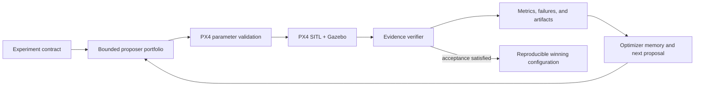

# AURORA Harness Engineering

**AURORA** expands to **Agentic UAV Refinement through Optimization,
Reflection, and Assurance**. It is DroneDream's evidence-gated agentic
optimization Harness. DroneDream is not a replacement flight simulator: PX4
SITL and Gazebo remain the flight-control and physics engines. AURORA adds a
reproducible layer around them so a user can define an experiment once and let
the system propose, execute, verify, compare, and learn from many bounded
trials. Here, assurance means provenance-bound software evidence and fail-closed
authority boundaries; it does not claim formal proof, airworthiness
certification, or safety assurance for a real aircraft.



## Product boundary

- PX4 owns flight-control firmware, parameters, failsafes, and SITL behavior.
- Gazebo owns the simulated world, vehicle dynamics, sensors, entities, and
  physics plugins.
- DroneDream owns experiment orchestration, parameter safety bounds, candidate
  generation, trial isolation, evidence validation, comparison, recovery,
  reporting, and human-facing workflow.
- An input field is not proof that an effect happened. A trial may claim an
  advanced physical effect only when the launcher returns validated evidence
  tied to the exact request, execution identity, and applied mechanism.

## Scenario-effect contract

Every physical scenario request is normalized into
`dronedream.scenario_effect_request.v1`. The launcher returns
`dronedream.scenario_effect_evidence.v1`. The outer runner verifies:

1. request SHA-256 and schema version;
2. job, trial, and execution identity;
3. one result for every requested effect;
4. the named application mechanism and its read-back evidence;
5. no unsupported or unverified effect before a trial can pass.

This contract lets future Runtime adapters add PX4/Gazebo functionality without
weakening the result semantics.

## Current physical capability matrix

| Effect | Current bundled Runtime status | Required proof |
| --- | --- | --- |
| Static box/cylinder obstacles | Implemented in bundled runner source; released-Runtime acceptance pending | Gazebo EntityFactory returns `data: true`; evidence stores entity name, service, source index, and generated SDF hash |
| Constant horizontal wind (`x500` family) | Verified in pinned dedicated WSL Runtime; signed installer Runtime acceptance pending | Trial-local model/world/rootfs hashes, exact `/wind_info` vector read-back, and expanded runtime SDF proving the exact spawned instance (for example `x500_0/base_link`) has WindMode |
| Periodic gusts and turbulence | Runtime extension required | Versioned stochastic plugin configuration, seed binding, and bounded observed wind-state evidence |
| GPS, barometer, and IMU noise | Runtime extension required | Generated sensor SDF plus model/sensor identity and effective noise configuration |
| GPS dropout/failure schedule | Runtime extension required | PX4 failure command/event timeline plus observed estimator/sensor state |
| Battery degradation | Runtime extension required | Applied PX4 battery simulation settings and read-back telemetry |
| Payload mass/inertia | Runtime extension required | Generated model/inertial definition and Gazebo entity read-back |
| Actuator delay/failure | Runtime extension required | Supported PX4/Gazebo injection mechanism and timestamped response evidence |

“Verified in pinned dedicated WSL Runtime” is not the same as “released to
customers.” Static obstacles and constant wind still require a rebuilt,
smoke-tested, signed installer `DroneDreamRuntime`. “Runtime extension required” is
deliberate: the desktop UI can collect and validate the remaining scenarios,
but the real runner refuses to label them as physically applied until the
dedicated Runtime contains a verified adapter.

## Expansion order

1. Rebuild the Runtime and pass the constant-wind plus obstacle smoke matrix.
2. Add versioned gust/turbulence generation with seed and interval read-back.
3. Add per-trial sensor model generation for GPS, barometer, and IMU noise.
4. Add PX4-supported failure injection with an explicit event scheduler.
5. Add battery and payload model adapters with telemetry/read-back checks.
6. Add actuator fault adapters only for mechanisms supported by the pinned PX4
   and Gazebo versions.
7. Rebuild, smoke-test, sign, and release `DroneDreamRuntime`; source changes do
   not become customer capabilities until this release gate passes.

## Safety and reproducibility rules

- Never mutate the user's personal Ubuntu distribution; the desktop installer
  operates only on the dedicated `DroneDreamRuntime` WSL distribution.
- Pin PX4, Gazebo, Python dependencies, and Runtime manifests.
- Keep every proposal inside catalog and user-defined bounds.
- Preserve requested parameters, applied parameter read-back, scenario-effect
  request/evidence, telemetry, logs, metrics, and failure taxonomy per trial.
- Treat simulation winners as candidates for controlled validation, not proof
  of safety on a real aircraft.

## Bounded model decision context

The optional `llm_harness` mode does not give a model direct simulator or
parameter authority. At each generation boundary, deterministic code compiles a
versioned evidence snapshot containing remaining budget, scenario cost, search
progress, stagnation, feasibility/failure statistics, and bounded per-tool
history. It also receives a bounded, enum-only memory of recent tool dispatch
outcomes, allowing a later generation to react when a prior tool exhausted its
search space or dispatched no candidates. The model may select one identifier
from the closed optimizer registry; the server validates that identifier and
remains the only dispatcher. The dispatcher skips the model entirely when no
generation or Trial budget remains, so an impossible plan cannot consume
provider quota before deterministic rejection.
The displayed full-Candidate Trial cost and remaining full-Candidate capacity
come from the same validated scenario-matrix compiler used by dispatch, including
enabled training and holdout seed rows rather than the legacy Job default.

Provider calls are protected by a persistent finalization claim rather than an
in-memory mutex or `updated_at` heuristic. Each claim binds an opaque token to
the Job's current generation and an explicit expiry; an independent database
session renews it while the provider is running. After the provider returns,
the server executes a conditional Job update for the same status, token,
generation, and still-live expiry before deterministic dispatch. The same fence
guards the aggregation-result commit and every failure, no-usable-candidate,
report, and terminal commit under SQLite and PostgreSQL. Report generation
acquires it before filesystem or object-storage writes and holds the Job row
through terminal commit. If another worker replaced the expired token, the old
worker rolls back its pending started/accepted/fallback events and every
Candidate/Trial mutation, and does not mark the Job failed or publish a report.
Cancellation first acquires the same Job-row serialization point and every
RUNNING or terminal transition clears all claim fields.

Every provider-call start event stores the bounded safe evidence snapshot and
static tool manifest with evidence, manifest, and full-prompt SHA-256 values plus
explicit prompt/trace versions. A pure verifier rebuilds the production messages
and detects snapshot, manifest, or prompt drift. This is a reproducibility check,
not a cryptographic signature or an immutable audit ledger.

Decision memory applies a stricter runtime provenance gate than the
operator-facing JobEvent view. Each model decision carries a fresh
`decision_id` through its started trace, accepted decision, and execution
result; deterministic fallbacks carry the same binding through the fallback
decision and result. A generation enters later routing evidence only when there
is exactly one complete pair, all generation/tool/source/hash/version fields
agree, the model-selected tool was in the started allowlist, and the generation
is reachable from current Job state. Orphan, duplicate, future, reordered, or
mismatched rows fail closed instead of steering a later optimizer choice.
Model-sourced memory additionally requires the persisted started trace to pass
the same full snapshot/manifest/prompt verifier used by offline audits.
Fallback memory requires its matching rejected decision. Pairing happens before
the recent-eight-memory bound is applied, so orphan or duplicate rows cannot
crowd one half of a valid pair out of the SQL window.

This provenance contract is deliberately not inferred for pre-contract events:
JobEvent rows written before `decision_id` and the binding hashes existed are
ignored. Deployments upgrading an actively used installation must complete,
cancel, or otherwise drain every in-flight `llm_harness` Job before rollout;
pausing alone is insufficient because a resumed legacy Job still lacks these
bindings. The release gate must verify that the non-terminal `llm_harness` Job
count is zero. Completed historical Jobs remain readable, but their legacy
routing events are not reused as model memory.

Exported decision-start events can be checked without database or provider access:

```powershell
cd backend
python -m scripts.verify_harness_decision_traces .\decision-events.jsonl
```

The verifier accepts a raw payload, a JSON array, or JSONL event export; ignores
unrelated event envelopes; emits only bounded identifiers, failure codes, and
computed hashes; and exits nonzero if no decision trace is present or any trace
fails current-version reconstruction.

Provider-visible evidence never includes user labels, candidate IDs, parameter
values, scenario IDs or seeds, free-form simulator/model text, credentials, or
arbitrary JSON. Mixed numeric/text metric arrays are rejected as a whole rather
than letting untrusted text affect the visible array shape. The snapshot keeps
the baseline, strongest measured candidates, and latest generations so historical
quality does not hide recent stagnation.
Long Jobs retain full-history stagnation computation while exposing only the first
and latest 31 generation-best points, preventing unbounded prompt growth. Tests
verify byte-for-byte prompt invariance under untrusted-field mutations and keep a
synthetic 1,001-Candidate history below the minimum configured 32 KiB prompt limit.
The router sees trusted training completion/failure/pass rates, feasibility
coverage, invalid/cancelled Trial counts, scalar loss, and best-to-runner-up score
gaps. Holdout status and values remain sealed from every adaptive decision so the
validation set cannot become another training signal.

The compatibility `gpt` parameter proposer follows the same validation firewall in
Prompt Schema 2.0. It receives allowlisted training scenario structure and numeric
inputs, while holdout types/IDs/seeds/configuration/results, Candidate labels/IDs,
arbitrary metric keys, and unknown failure strings are removed. This path still has
more authority than the closed-tool Harness and is not the preferred control plane.

## Versioned outcome and selection semantics

Every new or rerun Job now compiles
`dronedream.optimization-outcome/v1` before dispatch. The content-addressed
contract binds the objective/constraint configuration, enabled training and
holdout scenario identities, seed rows, case weights, acceptance thresholds,
metric sources/units, missing-metric treatment, failure treatment, and final
promotion rules. The same contract is persisted as a Job event, copied into the
reproducibility manifest, and referenced by every advanced Candidate aggregate.
Recognized pre-contract scenario aliases are normalized only for legacy export,
while the contract retains the original persisted-suite hash and records the
named compatibility transformation.
Final aggregation recompiles the contract and fails closed with
`OUTCOME_CONTRACT_DRIFT` if a recorded new-Job contract no longer matches the
persisted Job configuration.

Candidate selection uses Selection Key 1.0 with explicit lexicographic
precedence: complete evidence, hard feasibility, hard-constraint violation,
training failure rate, preference plus soft-constraint loss, then a stable
tiebreak. Hard constraints are no longer folded into `scalar_loss` and are no
longer represented by a `1,000,000` magic penalty. Soft constraints remain a
declared loss term; failed Trials remain a separately weighted rate. The
optimizer-learning reliability boundary (`failure_rate < 0.5`) is a named
constant sealed into the contract, and multiple bounds on one metric retain
separate constraint IDs instead of overwriting one observation. Traditional
CMA centering, public ranking, experimental optimizer observations, and reports
therefore consume compatible meanings instead of silently double-counting hard
feasibility.

Outcome Contract compiler 1.1 also fixes the objective representation used by
each numerical call. A Bayesian multi-objective call uses a complete joint
objective vector when one exists and otherwise falls back to declared scalar
loss; it never blends both. TuRBO and CMA-family scalar-state optimizers use
scalar loss only. Proposal metadata records the selected representation so the
decision can be replayed and audited.

Outcome Contract compiler 1.2 makes the scenario estimand hierarchical. Usable
replicates first pass through the declared within-case estimator (mean, worst,
CVaR, or percentile); the resulting case value then receives the case's full
frozen weight in the declared across-suite estimator. A failed replicate
therefore affects the separately modeled failure rate without silently
shrinking that scenario's objective weight. A dispatched case with no usable
metric produces no scalar objective, while constraints continue to inspect the
worst usable seed rather than a potentially safer case aggregate.

Outcome Contract compiler 1.3 freezes final-promotion projection semantics.
Acceptance RMSE is an unrounded within-case mean followed by the fixed
case-weighted mean, maximum error is the unrounded worst usable seed, and pass
rate uses every dispatched seed in each case denominator before case weights.
The evaluator consumes these versioned decision fields rather than rounded
display values.

Outcome Contract compiler 1.4 admits registered metrics only. Numeric keys in
adapter `raw_metric_json` remain report evidence until a reviewed registry
entry binds their source, unit, value kind, and semantics. Job creation,
reruns, and batch children reject unregistered objective or constraint names
with `INVALID_OUTCOME_CONTRACT` before a Job row or secret is persisted.

Outcome Contract compiler 1.5 records known metric dependencies and rejects
objective duplication before execution. The adapter-defined composite `score`
cannot be combined with another objective until its component graph is
registered, and `completion_rate`, `failure_rate`, and `failed_trial_rate`
cannot be combined as if they were independent reliability objectives or
constraints.

Outcome Contract compiler 1.6 freezes Bayesian preference inputs at the Job
boundary. Vector acquisition uses the configured objective weights and
normalization scales rather than observed extrema or per-call random
scalarizations. The optimizer request requires weights and scales to name the
same metrics, and an incomplete observed objective vector falls back to the
declared scalar loss (or exploration when no scalar evidence exists) rather
than silently optimizing a reduced problem. Proposal metadata records the
preference policy, weights, and scales used.

Outcome Contract compiler 1.7 adds a migration-safe
`CandidateOutcomeEvidenceV1` compatibility projection. New aggregates bind
the search-role objectives, constraints, selection key, acceptance fields,
candidate parameters, holdout projection, and exact Trial evidence snapshot
to a canonical SHA-256 identifier. Ranking, acceptance, publishability, and
optimizer learning read the verified projection when present and fail closed
on schema, hash, or bound-holdout mismatch. The payload is still embedded in
the legacy aggregate JSON; an append-only relational evidence ledger remains
a later database migration rather than a capability claimed by this slice.

Outcome Contract compiler 1.8 makes reduced-fidelity scenario coverage
case-stratified by contract. A screening matrix must execute at least one
replicate from every configured training case before allocating additional
replicates. The effective fidelity advertised to the numerical optimizer is
the actual executed fraction after this minimum is applied, so a small nominal
budget cannot silently omit difficult cases or claim less work than it ran.
Holdout cases remain reserved for full verification.

Outcome Contract compiler 1.9 defines
`dronedream.trial-outcome-taxonomy/v1`. Timeout, simulator failure, and
unstable-controller outcomes remain physical/domain failures; adapter,
simulator-process, artifact, and result-persistence failures are
infrastructure outcomes; cancellation and invalid evidence remain separate.
Only successes and trusted domain failures enter the optimizer-learning
denominator; unknown codes fail closed outside parameter learning. The
database-to-optimizer adapter materializes three explicit observation roles:
`objective` trains objective and feasibility models, `constraint_only` carries
trusted domain-failure feasibility evidence without a fabricated loss, and
`pending_reservation` prevents duplicate dispatch without training a model.
Terminal histories containing only infrastructure failures, cancellations,
invalid evidence, or unknown outcomes are quarantined before Bayesian, CMA,
portfolio, or optimizer-seed construction. Every non-success still remains in
acceptance/completion denominators, blocks complete evidence, and retains its
incurred work; this quarantine isolates optimizer learning only and never turns
a failed run into a passing or completed result.

Outcome Contract compiler 2.0 originally added same-batch proposal
attribution. The current contract upgrades that projection to
`dronedream.portfolio-sources/v2` and seals it inside
`dronedream.optimizer-source-evidence/v2`. An exact
parameter/fidelity action proposed by multiple child optimizers retains every
unique child source and divides reward credit so shares sum to one. Same-tool
duplicates cannot multiply credit. Reward attribution and child-local optimizer
state are separate: one content-addressed `learning_owner` identifies the
native source whose unchanged metadata can update CMA/TuRBO state, while all
verified exact native sources retain their equal reward shares. When an
emergency fallback arrives before an exact native collision, the native
proposal becomes the state-carrying envelope so a valid learning owner and its
child-local reconstruction fields cannot be lost. A lower-fidelity collision or
a source superseded by a higher-fidelity action remains visible but becomes
reward ineligible; emergency fallbacks, projected baselines, and unknown
generators remain ineligible under a closed source-role policy. The evidence
envelope binds strategy, generation, projected-parameter SHA-256, ordered
search-space contract SHA-256, requested/effective fidelity, source roles, and
equal reward shares. The search-space hash includes PX4 version, parameter
catalog version, vehicle type, airframe, and safe-bound enforcement, rather than
hashing rectangular domains alone. Optimizer history independently rebuilds the
generation-specific configured training case/seed matrix, deterministically
selects the subset implied by requested fidelity, and requires that exact set
and its recomputed coverage to match every Trial label, Candidate metadata, and
source envelope; missing, duplicated, mixed, or divergent coverage is
quarantined. Modern
observations fail closed when that envelope is
missing or divergent; legacy unsealed observations retain the old compatibility
normalizer. Portfolio statistics use fractional credit rather than awarding
one full reward to every source. This does not yet replace the need for an
append-only routing-opportunity/action ledger capable of preserving rejected
and historical collisions.

Outcome Contract compiler 2.1 freezes the online portfolio reward definition.
Each child is credited only for reducing the globally comparable full-fidelity
incumbent that existed before its generation began. Reward uses one fixed
normalized preference-loss unit, is bounded to `[0, 1]`, applies exact-source
shares, and records at most the best attributed reward once per child per
generation. Later tools cannot claim improvement over an obsolete baseline,
same-generation batch size cannot add rewards together, and observed extrema
cannot rescale historical credit. Cost, delay, action probability, and
append-only reward events remain outside this compatibility slice.

Outcome Contract compiler 2.2 closes the Candidate-context replay boundary.
When a Candidate carries required outcome evidence, acceptance, publishability,
and optimizer-learning readers now verify that the evidence's Candidate ID,
generation index, and parameter SHA-256 still match the current Candidate row.
A copied evidence envelope, changed generation, non-canonical parameter
snapshot, or post-aggregation parameter mutation produces no authoritative
projection and fails closed. The embedded evidence still needs a future
append-only relational ledger and current Trial-row re-verification.

Outcome Contract compiler 2.3 closes that remaining Trial-row gap. The canonical
training Trial snapshot—Trial ID, status, seed, scenario identity/config,
failure code, and accepted metric fields—is compiled in one shared function,
sorted deterministically, and re-hashed at acceptance, publishability, and
optimizer-learning reads. A post-aggregation status, scenario, failure, or
metric edit makes the Candidate evidence non-authoritative. Holdout Trial rows
remain covered by the separately bound holdout projection; artifact bytes and
physical-attempt lineage still require the future relational evidence ledger.

Outcome Contract compiler 2.4 adds
`dronedream.candidate-report-evidence/v1`. Final-display RMSE, mean/worst
maximum error, overshoot count, completion time, score, and reliability rates
are content-addressed and linked to the verified Candidate outcome-evidence
ID. A second hash binds every current Candidate Trial row, including holdout
rows, without exposing holdout results to adaptive optimization. JobReport,
real-runtime candidate summaries, reproducibility manifests, and PDF reports
read this verified projection; mutable compatibility fields beside it cannot
change the report, while a changed Candidate, Trial, projection, or hash fails
closed. Legacy aggregates remain readable. The evidence is still embedded in
aggregate JSON, so immutable physical-attempt rows, artifact digests, and a
relational evidence ledger remain future work.

Outcome Contract compiler 2.5 adds
`dronedream.winner-selection-evidence/v1`. Finalization records the complete
aggregated Candidate universe, each Candidate's outcome/report evidence IDs,
publishability disposition, Selection Key 1.0 tuple, deterministic rank, and
the stable optimizer-before-baseline/generation/ID tie-break. The envelope is
content-addressed and is reverified against current Candidate rows, Trial-bound
projections, ranks, baseline, and selected winner before any modern report is
published. JobReport, completion events, real-runtime report JSON,
reproducibility manifests, and PDF reports carry the resulting evidence or its
ID. Modern evidence-bound jobs fail closed when the envelope is missing or
diverges; legacy reports remain readable without manufacturing historical
proof. This proves the current deterministic selection over the persisted
Candidate set, but it is not yet the future atomic winner-freeze ledger or
sealed final-test boundary.

Outcome Contract compiler 2.6 adds
`dronedream.winner-freeze-receipt/v1`. Modern finalization inserts exactly one
receipt per Job while the Job holds `FINALIZING`; database uniqueness covers
both Job and evidence ID, and application re-entry succeeds only for an exact
evidence match. JobReport references the receipt, terminal events expose its
ID, and API/artifact/PDF readers reverify the receipt's full evidence plus
Job baseline/winner bindings before use. Missing or mutated modern receipts
fail closed, while legacy reports remain nullable. The receipt and terminal
state share the caller's database transaction, but this remains an
application-enforced compatibility ledger: external artifact files are not
atomically committed with the database, and a future append-only database role
or trigger should prohibit privileged out-of-band updates physically.

Outcome Contract compiler 2.7 makes the receipt append-only at the supported
database boundary. SQLite local/test initialization and Alembic install
`BEFORE UPDATE` and `BEFORE DELETE` guards; PostgreSQL installs the equivalent
trigger function. Unsupported production dialects fail migration instead of
silently omitting the invariant. Tests prove both mutations are rejected, then
deliberately remove a SQLite trigger to prove the independent API evidence
verifier still fails closed after a privileged bypass. A database owner can
still drop its own trigger, so operational role separation and audited
migration ownership remain deployment responsibilities.

Outcome Contract compiler 2.8 adds
`dronedream.artifact-digest-receipt/v1`. Every newly persisted real Trial
artifact and generated Job report artifact receives one content-addressed,
insert-once receipt binding the Artifact ID, owner type/ID, artifact type,
storage-path hash, content SHA-256, and byte count. Real Trial bytes use
attempt- and content-addressed keys of the form
`jobs/{job}/trials/{trial}/attempts/{attempt}/{type}/{sha256}-{name}`; exact
retries reuse verified bytes, while changed content cannot overwrite the
sealed object. Report JSON, event logs, reproducibility manifests, and PDF
generation canonicalize ordering and UTC timestamps; regeneration first
verifies existing bytes and rejects a changed result before any storage write.
Digest-bound local and S3-compatible downloads read and verify the stored bytes
before returning them, so a digest-bound S3 artifact never bypasses verification
through a presigned redirect. SQLite and PostgreSQL reject digest-receipt
updates and unauthorized deletes with database triggers. Explicit Job deletion
and retention cleanup create a transaction-scoped authorization row that is
removed by the same Artifact deletion, so sealed evidence does not make user
data undeletable. Unsupported production dialects fail migration. Legacy
metadata-only/mock artifacts remain nullable and retain their prior behavior.

This closes the retained-byte tampering gap at the supported application and
database boundaries, but it does not make object storage and SQL one atomic
transaction. A storage administrator can still delete or replace objects, and
a database owner can drop the mutation guards; production therefore still
needs object versioning/retention, least-privilege storage credentials,
separate migration ownership, and privileged-operation audit. The receipts are
not a substitute for those operational controls.

Outcome Contract compiler 2.9 adds
`dronedream.trial-artifact-evidence/v1`,
`dronedream.trial-outcome-evidence/v2`,
`dronedream.candidate-outcome-evidence/v2`, and
`dronedream.candidate-report-evidence/v2`. Aggregation now reconstructs the
complete Artifact set for every Candidate Trial, verifies every real stored
object against its immutable receipt, and binds a deterministically sorted
projection of Artifact ID/type, receipt/evidence ID, content SHA-256, byte
count, MIME type, and storage-path SHA-256 into the Trial row. Local and
S3-compatible verification streams SHA-256 rather than loading a whole large
artifact into memory. A real non-mock Artifact without a receipt, changed
metadata, missing row, extra row, cross-Candidate owner, or changed stored byte
fails closed. Historical `mock://` rows are labeled
`mock-metadata-only`—never falsely described as byte evidence—and remain
hash-bound as metadata.

Search-role Candidate outcome evidence contains only training Trial v2 rows.
Candidate report evidence independently binds every Candidate Trial v2 row,
including holdout, and reports sealed versus metadata-only counts. Report
publication re-verifies the current stored bytes before freezing/exporting the
winner. Existing v1 Candidate outcome/report envelopes remain readable and are
verified with their original digest rules; only newly aggregated Jobs opt into
v2. This closes the retained Artifact-to-Trial-to-Candidate-to-report byte
binding for the current compatibility layer. Physical execution-attempt
lineage, an append-only relational Candidate evidence ledger, object-store/SQL
atomicity, and an operational WORM policy remain separate future boundaries.

Outcome Contract compiler 2.10 adds
`dronedream.trial-execution-attempt-claim/v1`,
`dronedream.trial-execution-attempt-outcome/v1`,
`dronedream.trial-accepted-attempt-evidence/v1`,
`dronedream.trial-outcome-evidence/v3`,
`dronedream.candidate-outcome-evidence/v3`, and
`dronedream.candidate-report-evidence/v3`. Every newly claimed physical
execution now receives an immutable relational claim receipt binding the
logical Trial/Candidate/Job IDs, attempt count, backend, worker-ID hash,
lease-token hash, Candidate parameters, scenario/seed, Job configuration, and
claim timestamp. Its insert-once outcome is either the accepted terminal result
or an explicit `SUPERSEDED` result. Accepted outcomes bind the closed failure
taxonomy, metric snapshot hash, and the exact Trial artifact-evidence hash. Each
logical Trial has a one-time accepted-attempt pointer; a stale
worker can neither replace it nor publish metrics after a newer fencing token
wins.

Stale reclaim closes every older open claim before creating the new claim.
User cancellation seals an owned open claim as accepted cancellation. SQLite
and PostgreSQL triggers reject claim/outcome updates, ordinary deletes,
cross-Trial accepted pointers, and accepted-pointer replacement. Explicit
terminal Job deletion creates transaction-scoped authorization rows so user
data remains deletable. Training Candidate v3 evidence contains accepted
attempts only for training Trials; Candidate report v3 evidence independently
binds all accepted attempts, including holdout. Legacy Candidate v1/v2
envelopes retain their original verification rules.

This closes the logical-Trial-to-physical-attempt-to-artifact-to-Candidate
lineage at current aggregation, winner, report, and replay readers. Candidate
evidence was still embedded in mutable compatibility JSON rather than its own
append-only relational table at this revision.

Outcome Contract compiler 2.11 adds the relational Candidate ledger. The
current writer emits `dronedream.candidate-evidence-receipt/v2`; v1 receipts
remain readable for migration, but cannot be appended to or automatically
upgraded because they do not bind source identity or optimizer metadata. An
optimizer Candidate therefore cannot use v1 as modern training or publication
evidence without a controlled migration. Every new Candidate v3 aggregate
receives a relational, content-addressed receipt binding Candidate/Job identity,
generation and parameter hashes, `source_type`, the irreversible optimizer
source-evidence requirement state, the exact optimizer-metadata hash, the
complete aggregate hash, the linked
outcome/report evidence IDs and schemas, both Trial-evidence hashes, accepted
physical-attempt counts, revision number, and predecessor receipt. Readers
verify the complete contiguous revision chain and require the latest receipt to
match the current aggregate, source identity, provenance-required state, and
optimizer metadata byte-for-byte at the canonical-JSON boundary.
Publishability, acceptance, optimizer history, CMA-family selection, and report
publication all fail closed when that chain is missing, malformed, stale, or
divergent. Once any v2 receipt exists, ordinary reaggregation may append only
while the latest source identity, provenance-required state, and
optimizer-metadata hash still match the Candidate; it cannot reseal changed
source, strategy, credit, fidelity, or search-space provenance into a new
apparently valid revision.

The Candidate row also carries an irreversible
`evidence_ledger_required` gate. Aggregation turns it on before recording a
receipt; SQLite and PostgreSQL reject any later true-to-false transition. The
migration turns the gate on for pre-ledger rows that already contain v3
evidence. Consequently, deleting both the mutable JSON
envelopes and their compatibility markers cannot revive a legacy permissive
path. Such an upgraded legacy Candidate remains unavailable until trustworthy
reaggregation creates its relational receipt. Receipt updates and ordinary
deletes are rejected. Explicit terminal Job deletion writes transaction-scoped
Candidate-receipt and winner-freeze deletion authorizations, preserving the
user's right to delete the Job without weakening normal immutability. A
separate SQLite/PostgreSQL provenance guard rejects changes to `source_type` or
`optimizer_metadata_json` after the ledger gate turns on.

This closes the mutable Candidate-envelope fallback at supported application
and database boundaries. A database owner can still drop the guards, and SQL
and object storage are not one atomic commit.

Outcome Contract compiler 2.12 adds
`dronedream.telemetry.v2` and
`dronedream.telemetry-semantic-contract/v1`. Every successful bundled
PX4/Gazebo Trial now freezes the normalized units, coordinate frame, time
origin, source kind and digest, extraction revision, normalized-sample digest,
synthetic status, and sampling evidence. ULog-derived telemetry additionally
binds the original ULog digest/size, PX4 local-NED origin, extractor revision,
and explicit NED-to-z-up transform. The runner rejects sparse/gapped physical
telemetry, rechecks the trimmed evaluation window, and no longer turns a
missing physical flight window into an ordinary all-samples result.

RMSE is now trapezoidally time-weighted rather than sample-count weighted, so
selectively dense sampling cannot dilute a long error interval. The successful
PX4 result binds the integration rule and semantic-contract fields into its
raw metrics. `real_cli` then independently reloads the bounded artifacts,
revalidates telemetry v2, and fails the complete Trial when the telemetry,
reference track, sampling evidence, source binding, unit/frame/time contract,
or metric binding is missing or divergent.

This closes the previously identified telemetry-semantic and sampling-weight
gaps for the bundled runner. It does not preserve every original ULog byte
under a WORM policy or prove that an origin digest corresponds to a raw log
that was not retained.

Outcome Contract compiler 2.13 adds
`dronedream.px4-core-metric-evidence/v1`. The runner records exact evaluation
sample indices, but a separate backend compiler ignores its reported core
metric values, reloads retained telemetry/reference-track evidence, repeats the
bounded ordered local three-dimensional segment projection, and independently
recomputes evaluation/full-log time-weighted RMSE, maximum error, duration,
endpoint error, tracking-error peak count, sampling, and the maximum-error
sample. Its content-addressed evidence, top-level metrics, and raw projections
must match exactly. A changed reference path, evaluation index, telemetry
sample, metric value, or nested evidence field fails the complete Trial.

This closes trust in runner-authored core geometry values for the bundled
PX4 path.

Outcome Contract compiler 2.14 adds
`dronedream.px4-evaluation-policy/v1` and
`dronedream.px4-evaluation-window-evidence/v1`. The policy freezes pass,
coverage, altitude-entry, near-track, consecutive-sample, and collapse
thresholds under a content address. A separate backend compiler ignores the
runner's selected indices and independently re-derives the evaluation window
from retained telemetry, reference track, optional offboard timing, and the
frozen policy. Offboard timing is only a broad candidate: the verifier repeats
ordered three-dimensional projection, consecutive altitude-and-near-track
entry, and landing trimming. Only explicitly synthetic telemetry can use the
labeled all-samples exception.

The runner's raw window projection, policy, and content-addressed window
evidence must match the backend result. Changed thresholds, timing bytes,
reference geometry, selected indices, or nested evidence fail the complete
Trial before core metrics are compiled.

Outcome Contract compiler 2.15 adds
`dronedream.px4-outcome-policy/v1` and
`dronedream.px4-outcome-evidence/v1`. From the retained telemetry, reference
track, independently selected window and core metrics, trusted scenario-effect
request, and optional executor evidence, the backend independently recomputes
crash/collapse, position-speed and track-error instability, continuous directed
arc coverage, backward travel, projection discontinuities, start/endpoint
reachability, scenario-effect readiness, pass, and every score component.

The runner's flags, progress fields, scenario-effect hashes, score, policy, and
content-addressed evidence must match. A mutated crash flag, favorable progress
claim, substituted scenario request, changed score, or nested evidence change
fails the complete Trial. Successful metric-bearing results cannot claim a
timeout because process/launcher timeouts are terminal failed Trials. The
desktop adapter-to-bundled-runner dry-run path is covered end to end, and known
JSON evidence is byte-bounded during the actual read.

Outcome Contract compiler 2.16 closes the bundled PX4 raw-source replay gap.
The local launch wrapper makes an atomic per-Trial `px4_source.ulg` snapshot
before extracting normalized telemetry. The runner publishes it as a
`px4_ulog` Artifact, and the backend streams the retained bytes through SHA-256
under the 1 GiB limit. A ULog-derived telemetry contract is accepted only when
exactly one retained origin Artifact has the expected MIME type, nonzero byte
count, SHA-256, and size.

The artifact must resolve inside the current Trial run directory, not merely
somewhere under the shared artifact root. This prevents a producer from
borrowing telemetry or ULog evidence from another Trial. Missing, duplicate,
empty, oversized, mutated, cross-Trial, or unexpected ULog evidence fails the
complete Trial before its metrics can enter Candidate evidence.

Outcome Contract compiler 2.17 closes the producer-selected failure-taxonomy
boundary. An external `trial_result.json` can retain a bounded claimed code and
reason for diagnostics, but every producer-reported failure is canonically
stored as `UNVERIFIED_SIMULATOR_FAILURE`. Malformed, missing, identity-mismatched,
or internally inconsistent results become `INVALID_SIMULATOR_RESULT`, while
the adapter's own wall-clock kill becomes the infrastructure code
`SIMULATOR_EXECUTION_TIMEOUT`.

All three classes block completeness and acceptance. They are excluded from
parameter learning, Candidate ranking penalties, and LLM scenario feedback.
Only trusted domain failures may shape the optimizer's constraint model.
Unknown canonical codes remain visible operational evidence but are
quarantined from optimizer learning. GPT prompt schema 2.2 derives its trial
denominator and failure rate from this same closed optimizer-learning
projection.

Outcome Contract compiler 2.18 closes the model-feedback read boundary.
`compile_candidate_feedback()` is now the single training-feedback compiler
shared by the closed-tool Harness and the direct GPT parameter proposer. For a
modern Candidate it independently regenerates canonical training Trial rows,
verifies the content-addressed Candidate outcome projection against the current
Candidate ID, generation, parameter snapshot, and Trial evidence hash, and
derives the provider-visible score, feasibility, metrics, and outcome counts
from that verified projection.

Mutable sibling values such as `aggregated_score`, `scalar_loss`, or `rmse`
cannot override the evidence-bound values. A changed parameter snapshot,
changed Trial metric, incomplete relationship, or malformed evidence produces
an empty `quarantined` feedback view: it is neither treated as progress nor
converted into a parameter penalty. Legacy Candidates remain readable as
explicit `legacy_unsealed` feedback for migration compatibility. The direct
proposer exposes this closed status through Prompt Schema 2.3; AURORA keeps
its existing Evidence 2.4 shape while replacing the data source behind that
shape.

Outcome Contract compiler 2.19 closes the claim-to-simulator race. The worker
deep-copies one canonical claim-time snapshot before its first claim commit and
builds `TrialContext` from that same snapshot, including nested Candidate
parameters, case weight and advanced scenario configuration, reference track,
vehicle profile, and Job configuration. A pre-launch check rejects source drift
already committed when that gate runs as `INPUT_EVIDENCE_DRIFT`; the terminal
fence remains authoritative for any change racing or following that check.

Because a simulator may run outside the database transaction for minutes, the
terminal path reacquires the Trial completion CAS, row-locks the Job and
Candidate sources on PostgreSQL, and recomputes the combined receipt before any
metric, Artifact, or outcome is admitted. Drift during the external run
therefore rejects the result as invalid evidence instead of allowing it to
train the optimizer. Completion takes the same Job-before-Trial lock order as
cancellation so their race cannot form a reverse-order row-lock cycle. Legacy
v1 and v2 claims retain their original snapshot and verification rules.

Outcome Contract compiler 2.20 makes the configured Scenario Suite authoritative
at execution time. Dispatch and execution now share one canonical payload
builder. Before simulator I/O, the worker first rechecks the Job against its
creation-time, content-addressed Outcome Contract, then reconstructs the
generation-specific matrix, including deterministic seed offsets when common
random numbers are disabled. It proves the Trial's case, role, seed, weight,
source, generation, advanced configuration, and optimizer fidelity are exactly
authorized. A coordinated rewrite of both the Job suite and Trial is rejected
as `OUTCOME_CONTRACT_DRIFT`; a Trial-only mismatch is quarantined as
`SCENARIO_CONTRACT_DRIFT`, so neither can become optimizer evidence.

New physical attempts use
`dronedream.trial-execution-attempt-claim/v3`. In addition to the combined
execution snapshot, v3 binds Candidate source, generation, baseline role,
optimizer metadata, the Job's advanced scenario configuration, and a dedicated
scenario-contract digest. Any post-claim mutation of those authorities is
rejected as `INPUT_EVIDENCE_DRIFT`. Historical v1 and v2 receipts remain
verifiable with their exact original projections instead of being silently
upgraded to v3.

Execution Claim Gate 1.1 hardens worker concurrency at the physical-attempt
boundary. PostgreSQL workers select queue rows with `FOR UPDATE SKIP LOCKED`,
while the conditional status/lease update remains the cross-dialect
single-winner fence. A bounded collision loop makes SQLite development workers
and any conditional-update loser continue to the next eligible Trial instead
of reporting an empty queue while work remains. Two real-thread regressions
start eight workers simultaneously: one proves that a single logical Trial
creates exactly one simulator call, claim receipt, metric, accepted outcome,
and claim event; the other drains eight pending Trials and proves all attempt,
claim-evidence, and outcome-evidence identities are distinct. Each race is also
repeated ten times locally before the full regression gate.

Execution Scheduling Gate 1.0 removes global oldest-row monopolization from the
current simulation lane. Before choosing a Trial, the worker selects the
eligible Job with the fewest physical claims recorded across its Trials; ties
retain deterministic Job FIFO, and the oldest eligible Trial within that Job is
then selected. PostgreSQL briefly locks that Job row with `SKIP LOCKED`, so
simultaneous workers spread across runnable Jobs instead of serializing behind
one large experiment. The conditional Trial update and fencing token remain the
authority for exactly-once acceptance. A two-Job regression proves six
sequential claims alternate between Jobs while preserving each Job's internal
FIFO. This is the implemented small-scale per-Job fairness policy; per-user
weights, priority classes, capacity admission, and normalized resource-cost
scheduling remain future hosted-runtime controls.

Evidence Precision Gate 1.0 separates numerical authority from presentation.
`TrialMetric` persists the validated adapter/verifier value without an
aggregation-time rounding rewrite. Modern Candidate evidence retains unrounded
objective values, acceptance RMSE, worst-seed maximum error, pass/completion
rates, constraint margins, scalar loss, and Selection Key decision loss.
Four-decimal compatibility fields remain available for existing reports and
clients, but no longer decide promotion or rank. A regression gives two
Candidates the same displayed RMSE while their unrounded losses differ by one
millionth and proves the better canonical loss still sorts first.

Metric Dependency Gate 1.0 keeps the adapter-defined composite `score`
exclusive from other objectives until a reviewed component DAG exists. The
compiler also rejects known reliability aliases such as completion rate,
failure rate, and failed-Trial rate when more than one would represent the same
underlying outcome. Core compiler tests cover these combinations, and an API
regression proves a Job requesting both `score` and RMSE is rejected as
`INVALID_OUTCOME_CONTRACT` before any Job, Trial, provider secret, or simulator
work is created.

Prompt Schema 2.3 closes a separate model-feedback ambiguity. Earlier direct-GPT
feedback grouped Trials only by `scenario_type`, so two configured cases with
the same type but different weight or physical configuration could collapse
into one misleading mean. The compiler now assigns provider-safe
`training_case_N` aliases in frozen suite order and reports each matched case
separately with its declared weight, configured seed count, allowlisted numeric
configuration, metrics, and closed failure counts. Raw case IDs and unsupported
configuration text remain outside the prompt boundary; holdout cases remain
sealed. A regression deliberately inserts same-type wind cases in reverse Trial
order and proves that their evidence remains distinct and returns in canonical
case order.

The development routing corpus lives at
`backend/tests/fixtures/harness_routing_eval_v1.jsonl`. It contains 24 diagnostic
cases across eight routing regimes and uses the exact production prompt builder.
Its report includes uniform-random and all eight constant-tool baselines; the best
constant policy currently scores 14/24, so a candidate router must be compared
against that 58.33% floor rather than against chance alone.
The Report 1.1 development gate requires 75% overall, a 15-point lift over the
best constant tool, and at least 2/3 in every category before a router may advance
to a frozen simulator comparison.
Prediction Artifact 1.0 binds every offline result to canonical corpus and exact
production-prompt hashes plus Evidence/Tool/Prompt versions, provider, model
snapshot, sampling settings, selections, and rationales. Stale or incomplete
artifacts are rejected before grading.

Harness Evidence 2.4 and Tool Registry 2.1 add a deterministic precondition
gate before routing. The model receives only tools compatible with the current
parameter dimension, objective/constraint shape, scenario replication, scored
evidence, feasibility coverage, generation, and stagnation state. A globally
registered but context-ineligible selection fails closed to the deterministic
portfolio. Provider-visible failure counts now use the same optimizer-learning
taxonomy as Candidate ranking: infrastructure, cancellation, invalid evidence,
and holdout outcomes cannot make a parameter region or optimizer family appear
unsafe.

`backend/scripts/run_harness_routing_campaign.py` runs the entire corpus through
an online provider using the exact production prompt and per-case response
schema. It accepts credentials only from the environment, redacts provider
error bodies, validates every result locally, and publishes no output until all
cases complete. The final Artifact is created atomically and cannot replace a
prior freeze.

It is a regression tool, not evidence that model routing outperforms the
deterministic portfolio; that claim still requires the frozen simulator campaign.

### Locked deterministic router-policy holdout

The separate
`backend/tests/fixtures/harness_routing_policy_holdout_v1.jsonl` corpus is a
16-case, hash-locked **deterministic tool-eligibility policy holdout**. It is
not the 24-case development corpus, not a provider/model benchmark, and not
PX4/Gazebo evidence. Its strict manifest binds the canonical corpus, case IDs,
compiled policy inputs, and current development-corpus hash; all case IDs are
required to be disjoint.

`backend/scripts/run_locked_harness_routing_policy_holdout.py` evaluates the
exact production `eligible_harness_tools` capability gate without any network
or simulator call. Every expected eligible-tool set must match exactly. The
result is an immutable evaluation-only artifact. A central flow guard rejects
attempts to route the locked source into development evidence, model prompt
examples, router training, or runtime optimizer feedback, and the online
provider campaign refuses the locked source before creating a client.

This closes deterministic policy-boundary regression and leakage risks. It does
not show that an LLM selects the best optimizer or that any optimizer improves
simulation outcomes. The hand-authored labels are repository-visible after the
freeze, so this is also not a permanently blind generalization benchmark. Those
claims still require a separately frozen provider campaign and locked simulator
comparisons.
