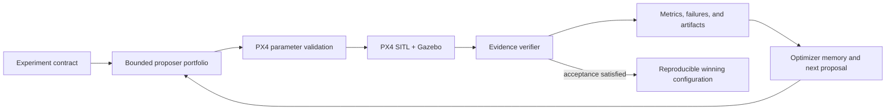

# DroneDream Harness Engineering

DroneDream is not a replacement flight simulator. PX4 SITL and Gazebo remain
the flight-control and physics engines. DroneDream adds a reproducible harness
around them so a user can define an experiment once and let the system propose,
execute, verify, compare, and learn from many bounded trials.

## Product boundary

- PX4 owns flight-control firmware, parameters, failsafes, and SITL behavior.
- Gazebo owns the simulated world, vehicle dynamics, sensors, entities, and
  physics plugins.
- DroneDream owns experiment orchestration, parameter safety bounds, candidate
  generation, trial isolation, evidence validation, comparison, recovery,
  reporting, and human-facing workflow.
- An input field is not proof that an effect happened. A trial may claim an
  advanced physical effect only when the launcher returns validated evidence
  tied to the exact request, execution identity, and applied mechanism.

## Scenario-effect contract

Every physical scenario request is normalized into
`dronedream.scenario_effect_request.v1`. The launcher returns
`dronedream.scenario_effect_evidence.v1`. The outer runner verifies:

1. request SHA-256 and schema version;
2. job, trial, and execution identity;
3. one result for every requested effect;
4. the named application mechanism and its read-back evidence;
5. no unsupported or unverified effect before a trial can pass.

This contract lets future Runtime adapters add PX4/Gazebo functionality without
weakening the result semantics.

## Current physical capability matrix

| Effect | Current bundled Runtime status | Required proof |
| --- | --- | --- |
| Static box/cylinder obstacles | Implemented in bundled runner source; released-Runtime acceptance pending | Gazebo EntityFactory returns `data: true`; evidence stores entity name, service, source index, and generated SDF hash |
| Wind vector and periodic gusts | Runtime extension required | Generated world/plugin configuration plus observed Gazebo wind state |
| GPS, barometer, and IMU noise | Runtime extension required | Generated sensor SDF plus model/sensor identity and effective noise configuration |
| GPS dropout/failure schedule | Runtime extension required | PX4 failure command/event timeline plus observed estimator/sensor state |
| Battery degradation | Runtime extension required | Applied PX4 battery simulation settings and read-back telemetry |
| Payload mass/inertia | Runtime extension required | Generated model/inertial definition and Gazebo entity read-back |
| Actuator delay/failure | Runtime extension required | Supported PX4/Gazebo injection mechanism and timestamped response evidence |

“Runtime extension required” is deliberate: the desktop UI can collect and
validate the scenario, but the real runner refuses to label it as physically
applied until the dedicated Runtime contains a verified adapter.

## Expansion order

1. Add deterministic wind world generation and a wind-observation smoke gate.
2. Add per-trial sensor model generation for GPS, barometer, and IMU noise.
3. Add PX4-supported failure injection with an explicit event scheduler.
4. Add battery and payload model adapters with telemetry/read-back checks.
5. Add actuator fault adapters only for mechanisms supported by the pinned PX4
   and Gazebo versions.
6. Rebuild, smoke-test, sign, and release `DroneDreamRuntime`; source changes do
   not become customer capabilities until this release gate passes.

## Safety and reproducibility rules

- Never mutate the user's personal Ubuntu distribution; the desktop installer
  operates only on the dedicated `DroneDreamRuntime` WSL distribution.
- Pin PX4, Gazebo, Python dependencies, and Runtime manifests.
- Keep every proposal inside catalog and user-defined bounds.
- Preserve requested parameters, applied parameter read-back, scenario-effect
  request/evidence, telemetry, logs, metrics, and failure taxonomy per trial.
- Treat simulation winners as candidates for controlled validation, not proof
  of safety on a real aircraft.

## Bounded model decision context

The optional `llm_harness` mode does not give a model direct simulator or
parameter authority. At each generation boundary, deterministic code compiles a
versioned evidence snapshot containing remaining budget, scenario cost, search
progress, stagnation, feasibility/failure statistics, and bounded per-tool
history. It also receives a bounded, enum-only memory of recent tool dispatch
outcomes, allowing a later generation to react when a prior tool exhausted its
search space or dispatched no candidates. The model may select one identifier
from the closed optimizer registry; the server validates that identifier and
remains the only dispatcher. The dispatcher skips the model entirely when no
generation or Trial budget remains, so an impossible plan cannot consume
provider quota before deterministic rejection.
The displayed full-Candidate Trial cost and remaining full-Candidate capacity
come from the same validated scenario-matrix compiler used by dispatch, including
enabled training and holdout seed rows rather than the legacy Job default.

Provider-visible evidence never includes user labels, candidate IDs, parameter
values, scenario IDs or seeds, free-form simulator/model text, credentials, or
arbitrary JSON. Mixed numeric/text metric arrays are rejected as a whole rather
than letting untrusted text affect the visible array shape. The snapshot keeps
the baseline, strongest measured candidates, and latest generations so historical
quality does not hide recent stagnation.
Long Jobs retain full-history stagnation computation while exposing only the first
and latest 31 generation-best points, preventing unbounded prompt growth. Tests
verify byte-for-byte prompt invariance under untrusted-field mutations and keep a
synthetic 1,001-Candidate history below the minimum configured 32 KiB prompt limit.

The development routing corpus lives at
`backend/tests/fixtures/harness_routing_eval_v1.jsonl`. It contains 24 diagnostic
cases across eight routing regimes and uses the exact production prompt builder.
Its report includes uniform-random and all eight constant-tool baselines; the best
constant policy currently scores 14/24, so a candidate router must be compared
against that 58.33% floor rather than against chance alone.
It is a regression tool, not evidence that model routing outperforms the
deterministic portfolio; that claim still requires the frozen simulator campaign.
