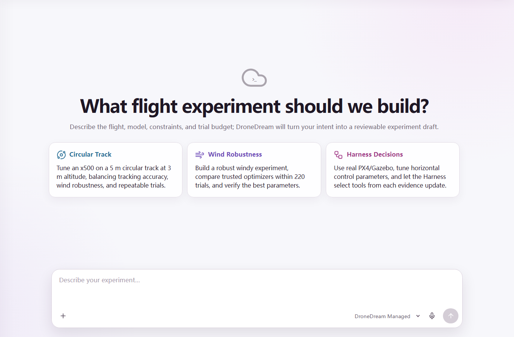
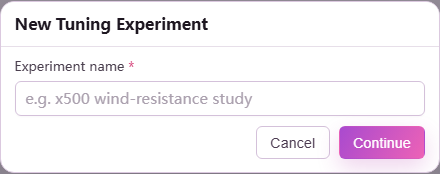
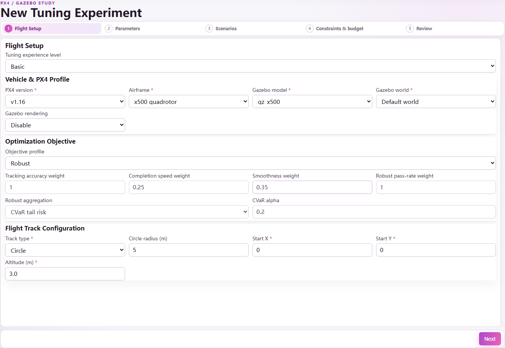
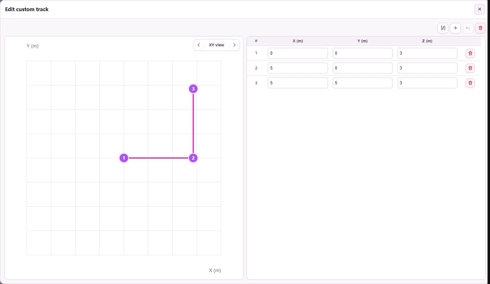
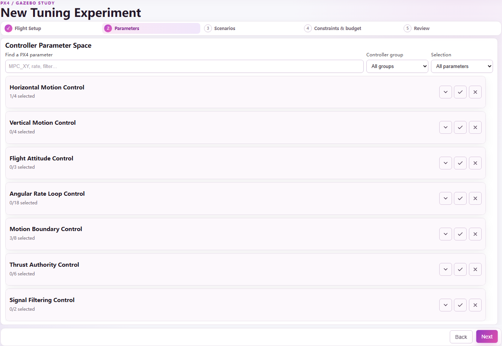
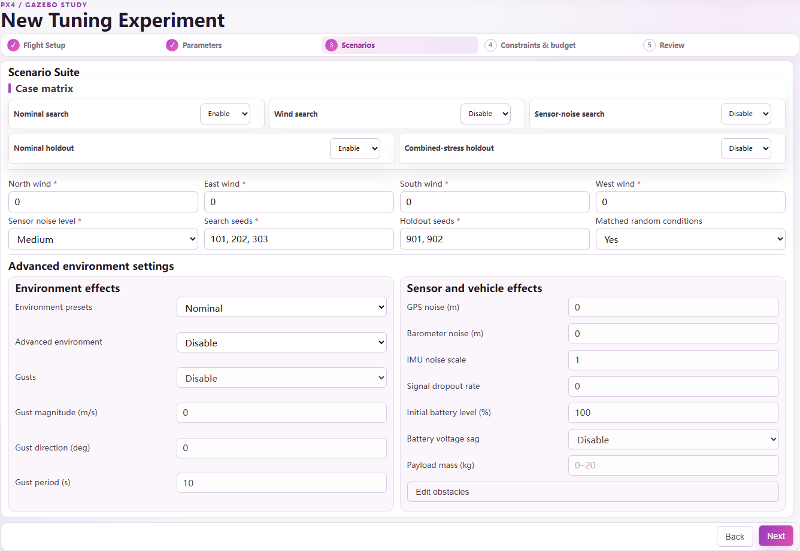
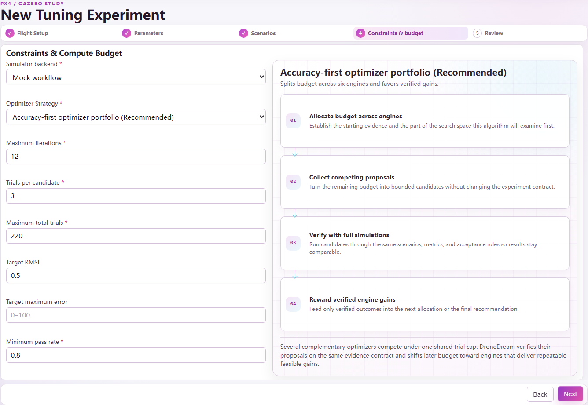
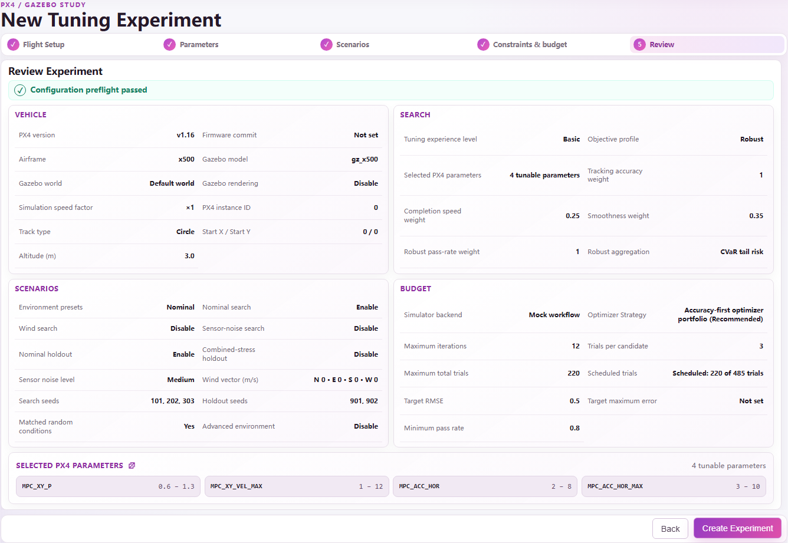
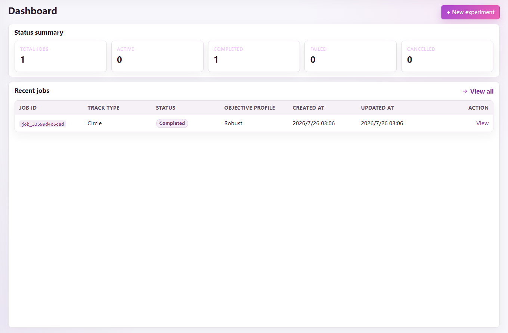
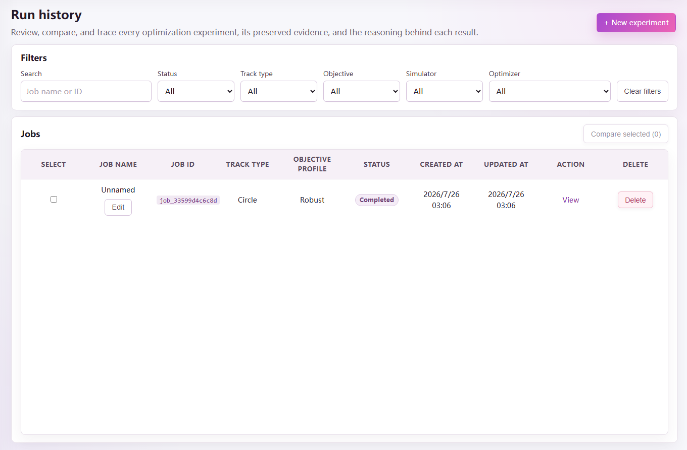

# About this manual

DroneDream is a control-parameter tuning platform for PX4 and Gazebo experiments. It helps you describe a flight task, define a bounded PX4 parameter space, construct search and holdout scenarios, choose an optimization strategy, and inspect the evidence behind every recommendation. This manual follows the current DroneDream 1.0.0 interface and explains not only where each control is located, but also what it changes, how to choose a value, and which invalid combinations prevent an experiment from being created.

Use this manual while building your first study or whenever a field is unfamiliar. The five-step wizard is deliberately fail-closed: **Next** remains unavailable until the current page is complete, and the final **Create Optimization Experiment** action appears only after the full configuration passes preflight validation. A completed form is a reviewable experiment specification; it is not yet proof that a candidate is safe for a physical aircraft or appropriate for a different simulator model and runtime.

> **Scope.** DroneDream 1.0.0 primarily supports control-parameter tuning in simulation. A result generated by the Mock backend is synthetic workflow evidence. A result generated by PX4/Gazebo becomes physical simulation evidence only when the runtime validates the requested artifacts and environmental effects.

## How to read the field references

Each field reference uses the same four questions. **Purpose** explains the effect of the field. **How to choose** gives a practical starting point. **Default** records the value in a new 1.0.0 draft. **Validation** states the rule that can block the next step. When a control is visible only in Advanced or Expert mode, the reference identifies that visibility requirement explicitly.

The screenshots use the current English interface. Their values are examples, not universal recommendations. Keep a baseline that already flies acceptably in the selected vehicle model, then use conservative search bounds before increasing the number of dimensions or the severity of environmental stress in a later, separately reviewed campaign stage.

# 1. Installation and first launch

## 1.1 System prerequisites

DroneDream 1.0.0 targets 64-bit Windows 10 and Windows 11. A complete PX4/Gazebo study also requires the owned DroneDream Runtime and the simulator components reported by the first-run checker. The installer and the desktop application are separate layers: completing an installation proves that the files were placed on disk, while completing the readiness gate proves that the application can start every service and tool required by the selected workflow without another setup pass.

Before installation, confirm that the chosen disk has enough free space for the application, runtime, simulator images, logs, and experiment evidence. Simulation output can grow much faster than the application itself, especially when rendering, screenshots, trajectory exports, or repeated holdout trials are enabled. Keep project and evidence directories on a stable local disk rather than a removable drive that could disconnect during an active optimization campaign run.

## 1.2 The readiness gate

At first launch, DroneDream checks the installed application version, owned runtime identity, required executables, writable data locations, backend health, local port availability, and compatibility anchors. The progress bar reaches 100% only after every required check has reached a terminal pass state. When the top-right status changes to **Checked**, the entry action is enabled and the verified result is cached for the remainder of that application session unless the environment changes.

If the readiness gate stops before 100%, use the displayed failure item rather than repeatedly restarting the application. A missing runtime, blocked executable, occupied port, unwritable directory, or incompatible component must be corrected at its source. You can run an explicit environment check later from **Settings**; ordinary page navigation does not repeat the full first-run probe.

## 1.3 Duplicate installations and updates

The installer should be allowed to update the registered DroneDream installation rather than creating unrelated copies in different folders. If Windows shows more than one installation entry, keep the newest signed or hash-verified 1.0.0 installation and uninstall the obsolete entry through Windows Settings. Do not delete runtime folders manually while a study is active, because its worker may still own files, processes, and leases that belong to that registered application installation record.

When downloading a new build, compare the published SHA-256 value with the downloaded installer before opening it. A matching hash proves that the bytes are the published bytes; it does not replace Windows code-signing checks. DroneDream remains version 1.0.0 in this manual, even when internal fixes are delivered under the same product version.

# 2. Workspace orientation

## 2.1 Main navigation

The left navigation contains **Tuning Chat**, **Dashboard**, **Run History**, and the course workspace. **Tuning Chat** turns a natural-language request into a reviewable draft. **Dashboard** summarizes experiments and quota usage. **Run History** lists jobs, supports filtering, and enables evidence comparison. Draft experiment names also appear in the **Experiments** area after they have been saved.



The settings button in the top-right corner controls language, model access, subscription and quota information, and explicit environment checks. Account actions are available from the profile control at the bottom of the sidebar. In the web console, selecting the DroneDream wordmark returns to the public website; the desktop application keeps navigation inside the installed product.

## 2.2 Account, profile, and cloud data

Your account identity, username, avatar, community topics, comments, likes, subscription tier, and managed-AI allowance are cloud-backed. A browser session and the desktop session can therefore show the same account data after each client signs in. Login cookies are origin-specific, so signing in on one website does not automatically sign in on a different domain.

Local experiment drafts are intentionally different. An unfinished draft is saved on the current client and may not appear automatically in another browser or on another device. Created jobs, server-side run records, community data, and account data can be shared because they have already crossed the explicit submission boundary into the cloud workspace.

## 2.3 Model access

DroneDream supports two model-access modes. **Platform allowance** uses the managed monthly credits attached to the account tier. **BYOK** means “bring your own key”: after the included allowance is exhausted, you can supply credentials for a supported model provider. A BYOK key is attached only to the submitted request that needs it and is not restored from a saved local draft.

Never paste an API key into a community topic, screenshot, exported configuration, or support message. If a key may have been exposed, revoke it at the provider immediately and issue a replacement. DroneDream validates the provider, model name, base URL, and key shape before submission, but the provider remains responsible for billing and access policy.

# 3. Two ways to create an experiment

## 3.1 Tuning Chat

Tuning Chat is the fastest way to begin when you can describe the desired flight in ordinary language. Include the vehicle, reference path, altitude, important objectives, expected disturbances, tentative budget, and any parameter family you already want to study. The assistant may propose values and identify missing information, but it can only produce a reviewable draft; it cannot silently create a job, consume a trial budget, start a simulator, or accept a candidate on the user’s behalf.

A strong request is specific enough to be reviewed: “Tune an x500 in PX4 v1.16 on a 5 m circular path at 3 m altitude. Prioritize tracking and robustness, include controlled horizontal wind, compare the standard position-loop parameters, reserve two holdout seeds, and keep the total below 220 trials.” After the draft appears, inspect every field in the five-step wizard before submission.

## 3.2 Create manually

Choose **Create manually** when you already know the study design or need precise control over every field. Enter a short experiment name first. A useful name identifies the vehicle, track, and purpose, such as `x500-circle-wind-robustness`. Names are required, may contain at most 255 characters, and should avoid secrets or personal data because they appear in history and reports.



The wizard saves valid progress locally. **Next** validates the current step before opening the next one; **Back** returns to earlier saved values. Changing an early field may invalidate a later field, so the final review always recompiles and validates the entire experiment rather than trusting a page-level result from an earlier saved local draft configuration.

# 4. Step 1 — Flight Setup

Flight Setup binds the study to a PX4 catalogue, vehicle model, simulator world, optimization objective, and reference trajectory. These choices determine which later parameter and scenario combinations are meaningful. Begin with the simplest environment that expresses the tuning question, then add stress cases after the baseline campaign behaves as expected.



## 4.1 Experience level and vehicle configuration

| Field | Purpose and how to choose | Default | Validation |
|---|---|---:|---|
| Tuning experience level | **Basic** shows essential controls. **Advanced** reveals runtime and objective details. **Expert** also exposes firmware pinning. The choice changes presentation, not the optimizer by itself. | Basic | Must be Basic, Advanced, or Expert. |
| PX4 version | Selects the compatible parameter catalogue and runtime contract. Use the version installed by the owned runtime. | v1.16 | Must be one of the versions returned by the active catalogue. |
| Firmware commit | Expert-only reproducibility pin. Enter the hexadecimal PX4 commit used to build the runtime when exact source identity matters. Leave blank when the runtime is version-pinned but not commit-pinned. | Blank | If present, 7–40 hexadecimal characters. |
| Vehicle type | Identifies the controller family. Version 1.0.0 exposes the multicopter workflow. | Multicopter | Must be compatible with the chosen airframe and model. |
| Airframe | Selects the PX4 airframe configuration. Use x500 for the bundled standard quadrotor study. | x500 | Must belong to the selected vehicle profile. |
| Gazebo model | Chooses the simulated vehicle and sensor payload. Begin with `gz_x500`; choose a camera, depth, gimbal, or lidar variant only when the study requires that sensor configuration. | gz_x500 | Must be a model supported by the runtime and airframe. |
| Gazebo world | Chooses terrain and world assets. Use Default for controller tuning, then ArUco, Baylands, Ridge, Walls, Windy, or Moving Platform when the question requires those conditions. | Default | Must be available to the selected runtime. |
| Gazebo rendering | Disable rendering for faster unattended numerical studies. Enable it when visual inspection or operator debugging is part of the evidence. | Disabled | Boolean; rendering support must be available when enabled. |
| Simulation speed factor | Advanced/Expert-only time multiplier. Keep 1× for first validation. Increase only after the runtime remains stable and deterministic at the selected rate. | 1 | Finite number from 0.1 through 100. |
| PX4 instance ID | Advanced/Expert-only identifier for multi-instance launches. Keep 0 for one vehicle; allocate a distinct integer for each parallel PX4 instance. | 0 | Integer from 0 through 255. |

### Model variants

The standard `gz_x500` model is the safest starting point because it minimizes unrelated sensor and plugin complexity. `gz_x500_depth`, `gz_x500_vision`, `gz_x500_mono_cam`, `gz_x500_mono_cam_down`, `gz_x500_lidar_down`, `gz_x500_lidar_front`, `gz_x500_lidar_2d`, and `gz_x500_gimbal` add specialized payloads. Selecting a richer model does not automatically improve control tuning; it only makes the corresponding simulated hardware available to the selected study.

## 4.2 Objective profile and robust aggregation

An objective profile converts flight evidence into a score that the optimizer can compare. **Stability** emphasizes controlled motion, **Speed** rewards faster completion, **Smoothness** penalizes aggressive transitions, **Robustness** gives more weight to repeatable performance across scenarios, and **Custom** lets Advanced or Expert users define the exact balance. Presets remain editable only where the selected experience mode exposes their component weights and robust aggregation controls.

| Field | Meaning | Default | Validation and guidance |
|---|---|---:|---|
| Tracking weight | Importance of following the reference trajectory. Increase when spatial error is the primary concern. | 1.00 | Finite value from 0 through 100. |
| Speed weight | Importance of completing the route quickly. Keep moderate until stable tracking is established. | 0.25 | Finite value from 0 through 100. |
| Smoothness weight | Importance of limiting abrupt control and motion changes. Increase for camera platforms or gentle trajectories. | 0.35 | Finite value from 0 through 100. |
| Robustness weight | Importance of consistent performance across the scenario matrix. Increase for wind, noise, or holdout-oriented studies. | 1.00 | Finite value from 0 through 100. |
| Robust aggregation | Combines repeated scenario results. **Mean** optimizes average behavior; **Worst** protects the weakest case; **CVaR** emphasizes a tail fraction; **Percentile** targets an explicit percentile. | CVaR | One supported aggregation; at least one objective weight must be greater than zero. |
| CVaR alpha | Fraction of the adverse tail included by CVaR. Smaller values focus on more extreme cases. | 0.20 | Greater than 0 and less than 1; used only by CVaR. |
| Percentile | Percentile used by percentile aggregation. A value of 95 emphasizes high-error outcomes. | 95 | Greater than 0 and at most 100; used only by Percentile. |

Do not give every objective a large weight merely to make it “important.” Weights express trade-offs, not independent pass conditions. Hard limits and acceptance criteria belong in Step 4, where a candidate can be rejected even if its weighted score is attractive.

## 4.3 Reference trajectory

The reference trajectory defines what the vehicle is asked to fly. Start X, Start Y, and Altitude place the generated path in the world. The built-in Circle, U-turn, and Figure-eight forms are reproducible and easy to compare; Custom is appropriate when the study must follow course geometry, a recorded mission, or a manually designed flight reference route.

| Field | Purpose and how to choose | Default | Validation |
|---|---|---:|---|
| Track type | Select Circle, U-turn, Figure-eight, or Custom. Use a built-in track for the first controlled campaign. | Circle | Must be a supported track type. |
| Circle radius | Radius of a generated circular path. Increase to reduce curvature demand; decrease to stress lateral tracking. | 5 m | Greater than 0 and at most 100 m. |
| U-turn straight length | Length of each straight segment before the turn. | 10 m | Greater than 0 and at most 200 m. |
| U-turn radius | Curvature of the U-turn. Smaller radii demand stronger lateral response. | 3 m | Greater than 0 and at most 100 m. |
| Figure-eight scale | Overall scale of the lemniscate. Smaller values increase curvature and crossing frequency. | 4 m | Greater than 0 and at most 100 m. |
| Start X / Start Y | Horizontal offset of the generated track in world coordinates. Keep 0,0 unless an obstacle, map, or multi-vehicle plan requires an offset. | 0 m / 0 m | Each value must be finite. |
| Altitude | Reference altitude for generated tracks. Choose a value clear of terrain and model spawn constraints. | 3.0 m | From 1 through 20 m. |
| Custom waypoints | Ordered JSON-backed list of X, Y, and optional Z coordinates. Use the editor rather than hand-editing JSON unless importing a known route. | None | At least two points; X and Y finite; Z finite when present; serialized route must stay within the editor limit. |

### Custom track editor

The custom editor supports XY, XZ, YZ, and 3D views; point insertion and deletion; undo and clear; numeric coordinate editing; selection synchronization between the plot and table; and JSON import/export. A generated track can also be converted into editable waypoints, which is useful when a standard path needs only a small course-specific adjustment.



Import JSON as an array of coordinate objects, for example:

```json
[
  {"x": 0.0, "y": 0.0, "z": 3.0},
  {"x": 5.0, "y": 0.0, "z": 3.0},
  {"x": 5.0, "y": 5.0, "z": 3.0}
]
```

After import, inspect the plotted order and altitude before continuing. Two points are sufficient for validation but usually insufficient for a useful closed flight study. Avoid duplicate consecutive points, implausibly sharp corners, coordinates outside the selected Gazebo world, and segments that demand unrealistic vehicle acceleration or instantaneous direction changes.

# 5. Step 2 — Parameters

Step 2 defines exactly what the optimizer is allowed to change. The catalogue is version-aware and groups PX4 variables by controller area. Selecting more parameters increases expressive power but also enlarges the search space, so a first study should tune the smallest controller loop that can explain the observed error and leave unrelated loops frozen at the recorded baseline.



## 5.1 Reading a parameter row

Each catalogue row contains the PX4 variable name, a localized description, current baseline, search minimum, search maximum, scale, related parameters, risk notes, and apply or reboot policy. Select the checkbox only when the study may change that parameter. Unselected rows remain documentation and do not consume search dimensions.

| Control | What it means | How to set it |
|---|---|---|
| Selected | Grants the optimizer authority to propose a value for this parameter. | Select at least one and no more than 64. Begin with one controller family. |
| Baseline | The known starting value and control candidate. | Use a value that already completes the nominal flight without a critical failure. |
| Search minimum | Lowest value any candidate may use. | Keep inside the catalogue hard range and preferably inside the conservative safe range. |
| Search maximum | Highest value any candidate may use. | Must exceed the minimum and remain inside the catalogue hard range. |
| Linear scale | Samples equal absolute intervals. | Use for ranges where additive changes have comparable meaning. |
| Log scale | Samples equal multiplicative intervals. | Use for strictly positive ranges spanning orders of magnitude; the lower bound must be greater than zero. |
| Related parameters | Warns about controller coupling or matched axes. | Review the linked parameters before widening one axis independently. |
| Restart/apply policy | States whether a PX4 restart or special apply boundary is required. | Keep reboot-required parameters visible in Review and account for runtime cost. |

The validator requires finite baselines and bounds, `minimum < maximum`, a baseline inside the chosen range, and a range inside the catalogue hard limits. Integer and enum parameters require integer baselines and integer bounds. The wizard also blocks an empty selection, more than 64 selected parameters, and a logarithmic range whose lower bound is zero or negative.

## 5.2 Recommended progression

For horizontal path-tracking error, begin with `MPC_XY_P`, `MPC_XY_VEL_MAX`, `MPC_ACC_HOR`, and `MPC_ACC_HOR_MAX`. If evidence indicates velocity-loop under-damping rather than position-loop error, add `MPC_XY_VEL_P_ACC`, `MPC_XY_VEL_I_ACC`, or `MPC_XY_VEL_D_ACC` in a later, separately reviewable campaign. For altitude behavior, use the `MPC_Z_*` family; for body attitude or angular-rate oscillation, isolate the relevant `MC_*` attitude or rate loop before widening another family.

Do not tune position, velocity, attitude, angular rate, thrust, and filtering families simultaneously in the first run. A wide high-dimensional campaign can fit noise, obscure which loop caused an improvement, and consume the budget before adequate holdout verification. Expand the space only after the previous report shows stable, repeatable evidence and no unresolved failure mode.

## 5.3 Core PX4 catalogue reference

The active backend catalogue is authoritative, and a compatible server may expose additional entries. The following built-in core subset documents the default, hard range, and conservative starting range shipped with the 1.0.0 frontend.

| Parameter | Controller role | Default | Hard range | Conservative start |
|---|---|---:|---:|---:|
| `MPC_XY_P` | Horizontal position proportional gain | 0.95 | 0–2 | 0.60–1.30 |
| `MPC_XY_VEL_P_ACC` | Horizontal velocity proportional gain | 1.80 | 1.2–5 | 1.2–2.8 |
| `MPC_XY_VEL_I_ACC` | Horizontal velocity integral gain | 0.40 | 0–60 | 0.10–1.00 |
| `MPC_XY_VEL_D_ACC` | Horizontal velocity derivative gain | 0.20 | 0.1–2 | 0.10–0.50 |
| `MPC_Z_P` | Vertical position proportional gain | 1.00 | 0.1–1.5 | 0.60–1.30 |
| `MPC_Z_VEL_P_ACC` | Vertical velocity proportional gain | 4.00 | 2–15 | 2.5–8 |
| `MPC_Z_VEL_I_ACC` | Vertical velocity integral gain | 2.00 | 0.2–3 | 0.5–2.5 |
| `MPC_Z_VEL_D_ACC` | Vertical velocity derivative gain | 0.00 | 0–2 | 0–0.50 |
| `MC_ROLL_P` | Roll attitude proportional gain | 4.00 | 0–12 | 2–8 |
| `MC_PITCH_P` | Pitch attitude proportional gain | 4.00 | 0–12 | 2–8 |
| `MC_YAW_P` | Yaw attitude proportional gain | 2.80 | 0–5 | 1–4 |
| `MC_ROLLRATE_P` | Roll-rate proportional gain | 0.15 | 0.01–0.50 | 0.08–0.25 |
| `MC_ROLLRATE_I` | Roll-rate integral gain | 0.20 | 0–1 | 0.05–0.40 |
| `MC_ROLLRATE_D` | Roll-rate derivative gain | 0.003 | 0–0.01 | 0.001–0.006 |
| `MC_PITCHRATE_P` | Pitch-rate proportional gain | 0.15 | 0.01–0.60 | 0.08–0.30 |
| `MC_PITCHRATE_I` | Pitch-rate integral gain | 0.20 | 0–1 | 0.05–0.40 |
| `MC_PITCHRATE_D` | Pitch-rate derivative gain | 0.003 | 0–0.01 | 0.001–0.006 |
| `MC_YAWRATE_P` | Yaw-rate proportional gain | 0.20 | 0–0.60 | 0.05–0.35 |
| `MC_YAWRATE_I` | Yaw-rate integral gain | 0.10 | 0–0.50 | 0.02–0.25 |
| `MPC_XY_VEL_MAX` | Maximum horizontal velocity | 12 m/s | 0–20 | 1–12 |
| `MPC_Z_VEL_MAX_UP` | Maximum upward velocity | 3 m/s | 0.5–8 | 1–5 |
| `MPC_Z_VEL_MAX_DN` | Maximum downward velocity | 1.5 m/s | 0.5–4 | 0.5–2.5 |
| `MPC_ACC_HOR` | Nominal horizontal acceleration | 3 m/s² | 2–15 | 2–8 |
| `MPC_ACC_HOR_MAX` | Maximum horizontal acceleration | 5 m/s² | 2–15 | 3–10 |
| `MPC_JERK_AUTO` | Automatic-mode jerk limit | 4 m/s³ | 1–80 | 2–20 |
| `MPC_TILTMAX_AIR` | Maximum airborne tilt | 45° | 20–89 | 25–60 |
| `MPC_THR_MIN` | Minimum normalized thrust | 0.12 | 0.05–0.50 | 0.08–0.25 |
| `MPC_THR_HOVER` | Hover normalized thrust | 0.50 | 0.10–0.80 | 0.25–0.60 |
| `MPC_THR_MAX` | Maximum normalized thrust | 1.00 | 0–1 | 0.60–1.00 |
| `MC_AIRMODE` | Air-mode enum: disabled, roll/pitch, or roll/pitch/yaw | 0 | 0–2 | 0–2 |
| `IMU_GYRO_CUTOFF` | Gyroscope low-pass cutoff; reboot required | 40 Hz | 0–1000 | 20–80 |

Hard range means “accepted by this catalogue,” not “safe for every vehicle.” The conservative start range is still only a software guardrail. Vehicle mass, inertia, actuator authority, sensor latency, and simulator fidelity determine whether a specific value is physically appropriate.

# 6. Step 3 — Scenarios

Scenarios determine where candidates learn and where they are judged. **Search** cases may influence the optimizer. **Holdout** cases are reserved for final acceptance and must never leak into candidate selection. Use common random numbers so competing candidates encounter the same seed-controlled disturbances and can be compared on matched conditions.



## 6.1 Scenario matrix and seeds

| Field | Purpose and how to choose | Default | Validation |
|---|---|---:|---|
| Nominal search | Evaluates candidates without requested wind or noise stress. Keep enabled for a stable reference. | Enabled | At least one search case must be enabled. |
| Wind search | Exposes candidates to directional wind during optimization. Enable only when runtime support is proven. | Disabled | Requested effect must be physically reported by the worker. |
| Noise search | Exposes candidates to the selected sensor-noise profile. | Disabled | Requested effect must be physically reported by the worker. |
| Nominal holdout | Tests the final candidate on unseen nominal seeds. | Enabled | Holdout seeds required when any holdout case is enabled. |
| Combined holdout | Tests an unseen combined-stress matrix. Use after individual effects have passed. | Disabled | All requested effects require runtime proof. |
| Search seeds | Reproducible random seeds used during candidate search. | 101, 202, 303 | One to 100 unique non-negative integers. |
| Holdout seeds | Seeds kept outside optimization and used only for acceptance. | 901, 902 | Unique non-negative integers; no overlap with search seeds. |
| Common random numbers | Reuses the same seed matrix for competing candidates, reducing comparison noise. | Enabled | Boolean; strongly recommended for controlled comparison. |

Seeds may be separated by commas or whitespace. Duplicate values are normalized, but search and holdout sets must remain disjoint. More seeds improve uncertainty estimates while multiplying trial cost, so increase them together with the hard budget rather than assuming the planner can fit every requested case automatically into the schedule.

## 6.2 Wind and sensor noise

North, East, South, and West wind fields define directional magnitudes from −10 through 10 m/s. Positive and negative values express direction according to the runtime contract; do not enter an absolute speed in every direction. The sensor-noise selector supports Low, Medium, and High qualitative profiles. Use the nominal profile first, then add one controlled disturbance family at a time so any resulting failure remains attributable to a specific, recorded environmental test condition and seed.

## 6.3 Advanced environment settings

The advanced panel provides Nominal, Wind/Gust, Sensor Degradation, and Combined Stress presets, plus direct effect controls. A preset fills related fields but does not bypass validation. Review every generated value before closing the panel.

| Field | Purpose | Valid range |
|---|---|---:|
| Gust enabled | Adds periodic gust requests to the scenario contract. | Boolean |
| Gust magnitude | Requested gust strength. Start below the sustained-wind envelope. | 0–30 m/s |
| Gust direction | Direction in degrees. | 0 inclusive to 360 exclusive |
| Gust period | Time between gust cycles. | Greater than 0 and at most 300 s |
| GPS noise | Position-noise magnitude applied by a supported runtime plugin. | 0–100 m |
| Barometer noise | Altitude-noise magnitude applied by a supported runtime plugin. | 0–100 m |
| IMU noise scale | Multiplier for the supported inertial-noise model. | 0–10 |
| Signal dropout rate | Fraction of samples removed by the supported effect model. | 0–1 |
| Initial battery | Battery state at scenario start. | 0–100% |
| Voltage sag | Requests a voltage-sag effect during the scenario. | Boolean |
| Payload mass | Additional vehicle payload. Leave blank when no payload is requested. | Blank or 0–20 kg |
| Obstacles JSON | Static cylinder or box objects injected into supported worlds. | JSON array, at most 100 entries |

Example obstacle configuration:

```json
[
  {"type": "cylinder", "x": 8, "y": 1, "radius": 0.7, "height": 4},
  {"type": "box", "x": 12, "y": -2, "size_x": 2, "size_y": 1, "height": 3}
]
```

Every coordinate must be finite, and every radius, size, and height must be positive. The bundled 1.0.0 runner currently proves static box and cylinder injection. Wind/gust, GPS or sensor degradation, battery behavior, payload, and actuator-delay effects require a compatible runtime extension and effect readback. DroneDream rejects a real run when the worker cannot prove that a requested effect was applied; it never relabels nominal physics as a successfully completed environmental stress test.

# 7. Step 4 — Constraints & Budget

Step 4 chooses the execution backend, optimization method, schedule, acceptance thresholds, and model-access route. Budget fields are hard limits, not estimates. The planner forms complete candidate-by-scenario groups and stops before the hard total would be exceeded, even if the nominal iteration count suggests that more proposals should remain.



## 7.1 Simulator backend

**Mock** provides deterministic synthetic results for validating the workflow, UI, data model, and report path. It does not launch PX4/Gazebo and must never be cited as flight-performance evidence. **PX4 / Gazebo** launches the real simulator path and is selectable only when capability checks report a ready runtime. A missing executable, incompatible runtime, or unavailable effect keeps the backend blocked.

Use Mock to learn the interface or test a draft cheaply. Before interpreting performance, repeat the study on PX4/Gazebo with validated artifacts, simulator identity, seed provenance, and effect evidence. A recommendation is only as strong as the backend, measurement contract, runtime identity, seed provenance, and reproducible artifacts that produced it.

## 7.2 Optimizer selection

| Optimizer | Best use | Important boundary |
|---|---|---|
| Accuracy-first optimizer portfolio | Recommended general-purpose choice. Six complementary engines compete under one shared budget and later allocation favors repeatable feasible gains. | Requires enough budget to compare engines fairly. |
| LLM tool orchestration Harness | Uses a compact evidence packet to choose a trusted optimizer from a closed registry while local validators retain execution authority. | Uses model access; invalid decisions fall back deterministically. |
| Failure-aware constrained MOBO | Multiple objectives with crashes, timeouts, or hard feasibility constraints. | Needs enough successful and failed observations to model feasibility. |
| Multi-fidelity constrained MOBO | Studies with valid cheap screening and complete verification levels. | Screening evidence cannot substitute for final PX4/Gazebo verification. |
| TuRBO-inspired trust-region BO | Coupled parameters where useful improvements are expected near the current best. | Can miss distant basins if the initial region is poorly chosen. |
| SAAS-inspired constrained BO | Higher-dimensional spaces where only a few parameter axes are expected to dominate. | Still requires disciplined bounds and adequate evidence. |
| Surrogate-assisted CMA-ES | Expensive populations where a learned surrogate can rank candidates before simulation. | Surrogate predictions are not accepted without real evaluation. |
| BIPOP-inspired CMA-ES | Multimodal spaces where alternating restart sizes may escape local optima. | Restart exploration consumes substantial budget. |
| CMA-ES | Continuous parameter baselines and compatibility comparisons. | No native model reasoning; categorical structure is limited. |
| GPT proposal mode | Direct model-generated candidate proposals for compatibility studies. | Uses model access; all proposals remain locally validated. |
| Heuristic | Inexpensive deterministic perturbation baseline. | Useful as a baseline, not a claim of global optimality. |
| None | Runs the locked baseline through the scenario matrix. | No tuning occurs; use to establish reference evidence. |

The optimizer never receives unrestricted execution authority. Candidate values are compiled against the frozen parameter space, trial budget, scenario matrix, and acceptance contract. Unavailable tools, malformed model decisions, out-of-range values, and stale evidence are recorded and rejected or routed to a deterministic, auditable fallback.

## 7.3 Schedule and acceptance fields

| Field | Purpose and how to choose | Default | Validation |
|---|---|---:|---|
| Maximum iterations | Maximum optimizer generation updates. Increase only when the trial cap and scenario matrix can support it. | 12 | Integer from 1 through 100. |
| Trials per candidate | Compatibility repeat count used by older workers and simple schedules. | 3 | Integer from 1 through 10. |
| Maximum total trials | Hard ceiling across baseline, search, failed, and scheduled trials. This is the main cost guard. | 220 | Integer from 1 through 10,000 and large enough for the minimum complete schedule. |
| Target RMSE | Optional tracking-error threshold for acceptance. | 0.5 | Blank or finite value from 0 through 100. |
| Target maximum error | Optional bound on the worst spatial error. | Blank | Blank or finite value from 0 through 100. |
| Minimum pass rate | Required fraction of scenario trials that pass acceptance. | 0.8 | Finite value from 0 through 1. |

If **Next** reports that the budget is too small, do not merely add one trial. Count the selected search cases, seeds, repeats, baseline evaluation, and candidate groups, then choose a ceiling that admits complete groups. DroneDream intentionally avoids partial matrices because comparing a candidate tested under fewer cases with one tested under more cases would corrupt the decision.

## 7.4 Platform allowance and BYOK

Platform allowance is the default model route when the selected account tier still has managed credits. BYOK becomes the fallback after the allowance is exhausted or when a supported custom provider is explicitly chosen. Model-using optimizers remain blocked when neither route has valid credentials, a reachable model, and a supported provider contract.

| BYOK field | Requirement |
|---|---|
| Provider | Choose OpenAI, Qwen, DeepSeek, or Custom according to the credential issuer. |
| API key | Required in BYOK mode and limited to 512 characters. It is not restored from local drafts. |
| Model | Required for non-OpenAI providers and limited to 128 characters. Use a model identifier accepted by that provider. |
| Base URL | Required for non-OpenAI providers. Must be HTTP or HTTPS, have a hostname, contain no embedded username/password, and contain no query string or fragment; maximum 2,048 characters. |

The application may display quota consumed and quota remaining, but the provider’s metering remains authoritative for BYOK billing. Do not enter a browser login password, Supabase key, service-role secret, or unrelated cloud credential in the API-key field.

# 8. Step 5 — Review

Review is a compiled preflight view of the entire study. It summarizes vehicle and runtime identity, objective and aggregation, selected parameter ranges, scenario and seed separation, optimizer, backend, planned budget, acceptance criteria, and model access. A green **Configuration preflight passed** message means the submitted specification is internally consistent; it does not guarantee that a future simulation will complete successfully or satisfy every configured acceptance condition.



Open the selected-parameter details and inspect every baseline and bound. Confirm that holdout cases are genuinely unseen, the hard trial ceiling is affordable, the chosen backend matches the evidence claim, and every advanced effect is supported. Use an issue link to return directly to the field that failed; after editing, continue forward again so later dependencies are revalidated.

Only **Create Optimization Experiment** crosses the job-creation boundary. Tuning Chat, draft autosave, step navigation, and Review cannot start a simulator. After creation, the worker leases trials, applies a fenced candidate, launches the backend, validates artifacts, aggregates scenario evidence, and requests the next candidate. Cancellation, stale workers, or lost leases cannot commit a winning result into the experiment record, comparison set, evidence ledger, or final generated report.

# 9. Monitor, compare, and interpret results

## 9.1 Dashboard

The Dashboard summarizes experiment counts and recent activity. Use it to confirm that a job was created, identify work still running, and navigate to the detailed evidence view. A draft that exists only in the current browser may not appear here until it has crossed the explicit creation boundary and received a durable, queryable server-side job identifier.



## 9.2 Run History

Run History filters by name or ID, status, track type, objective, simulator, and optimizer. Select compatible jobs before choosing **Compare selected**. Comparison is meaningful only when the studies share compatible vehicle, parameter, objective, scenario, and evidence contracts; the interface may block or warn about configurations that cannot support a fair comparison.



Deleting a job is a destructive action and should be used only after required reports and artifacts are exported. A deleted local draft and a deleted server job are different objects. Before removal, confirm that the job ID, report, evidence ledger, and any reproducibility package have been retained according to the project’s evidence-retention policy and audit requirements.

## 9.3 Job evidence

The job detail view separates live worker state, heartbeat and cancellation controls, candidate history, per-scenario trials, trajectory replay, acceptance and holdout results, optimizer provenance, and downloadable artifacts. Read the evidence in that order: first confirm that the correct backend and scenario effects ran, then compare performance metrics, and only then interpret the recommended parameters.

Important terminal outcomes include success, maximum iterations reached, no usable candidate, simulator unavailable, and scenario or outcome contract failures. A failed trial is data only when its failure class and artifacts are trustworthy. Infrastructure faults, missing artifacts, or unproven effects must not be treated as evidence that a parameter region is physically bad.

## 9.4 Reports and watermark policy

Each completed study can export a report covering configuration, candidate generations, trial results, feedback, parameter changes, acceptance, holdout evidence, and reproducibility identifiers. Free-tier PDF reports include the DroneDream verification watermark. Plus and Pro reports are watermark-free. The watermark identifies the report tier; it does not certify that a real aircraft is safe.

Preserve the source job ID and evidence hashes with every exported report. If a report is regenerated after software changes, compare its provenance and source commit rather than assuming two visually similar PDFs describe identical evidence.

# 10. Exit, recovery, and safe interruption

Closing DroneDream while a draft is open triggers a warning and attempts to preserve the draft on the current client. Closing while a simulation is active stops the local application path and may interrupt the worker; use the job cancellation action first when possible so the server records a deliberate terminal state. The close control must remain usable even when preservation or cancellation encounters an error, because the user must never be trapped inside the application during recovery.

After an unexpected shutdown, reopen the application and wait for the readiness gate. Inspect Run History before starting a replacement job. A server-side job may already be completed, cancelled, expired, or waiting for lease recovery, and blindly creating a duplicate can waste budget or create evidence with ambiguous experiment lineage and ownership.

# 11. Troubleshooting

## 11.1 Next is disabled

Read the first visible field error on the current page. Common causes are an empty experiment name, unsupported PX4 version, invalid firmware commit, zero objective weights, invalid track geometry, no selected parameter, bounds outside the catalogue, overlapping search and holdout seeds, no enabled search scenario, a trial ceiling below the minimum schedule, or backend and model capabilities that are not currently available to the selected runtime, provider, account, and execution mode.

If the error refers to a later field after you changed an earlier page, continue through the wizard and revise the dependent value. The final compiler intentionally rechecks the entire draft because a previously valid optimizer, parameter set, or budget may no longer match the new vehicle, runtime, objective, scenario matrix, or final submitted evidence contract.

## 11.2 PX4 / Gazebo is unavailable

Open Settings and run the explicit environment check. Confirm runtime ownership, executable paths, version anchors, writable directories, local ports, and backend health. Do not switch to Mock merely to make the error disappear if the report will be presented as physical simulation evidence; Mock proves only the application workflow and data path.

## 11.3 An advanced effect is rejected

The selected runtime does not provide a verifiable launcher or readback contract for that effect. Remove the effect to run a nominal study, or install a compatible runtime extension and rerun the capability check. The bundled runner proves static box and cylinder obstacles, while other advanced effects depend on runtime support and explicit effect readback.

## 11.4 Camera access fails

Camera capture requires a secure browser context such as HTTPS or localhost, operating-system permission, browser permission, and an available camera device. A bare HTTP IP address is not a secure context and can be denied even when the user clicked Allow. Use the HTTPS public site or the desktop application, then verify Windows **Privacy & security → Camera**, the browser site-permission icon, the selected camera device, and whether another application already holds an exclusive device lock.

## 11.5 A model optimizer is unavailable

Check the managed-credit balance, subscription tier, provider selection, and BYOK fields. Confirm that the base URL is a clean HTTP/HTTPS origin without embedded credentials, query parameters, or fragments. If the model remains unavailable, choose the deterministic optimizer portfolio; the job must not proceed through an unvalidated model route.

## 11.6 Results look better but fail acceptance

The optimizer score and acceptance contract answer different questions. A candidate can improve the weighted objective but still violate maximum error, pass-rate, feasibility, or holdout requirements. Inspect per-scenario trials and failure categories, then decide whether the candidate is genuinely unsuitable or whether the original acceptance thresholds did not represent the intended engineering requirement.

# 12. First-study checklist

1. Confirm that the readiness gate reaches 100% and the environment status reads **Checked**.
2. Use a descriptive experiment name and select the installed PX4 version.
3. Start with `gz_x500`, Default world, rendering disabled, and simulation speed 1×.
4. Use a built-in track and a known-flying baseline before importing custom geometry.
5. Select one controller family and keep bounds inside the conservative catalogue range.
6. Enable nominal search, nominal holdout, disjoint seeds, and common random numbers.
7. Use Mock only for workflow rehearsal; use validated PX4/Gazebo for simulation evidence.
8. Choose the optimizer portfolio unless the study has a specific methodological reason to use another optimizer.
9. Set a hard trial ceiling that admits complete candidate-by-scenario groups.
10. Inspect every review block before creating the job, then export the final report and evidence identifiers.

# Appendix A — Common study patterns

## A.1 Horizontal circular-track tuning

Use `gz_x500`, Default world, a 5 m circle at 3 m altitude, and the Robustness objective. Begin with `MPC_XY_P`, `MPC_XY_VEL_MAX`, `MPC_ACC_HOR`, and `MPC_ACC_HOR_MAX`; keep nominal search and nominal holdout enabled with disjoint seeds. Establish a PX4/Gazebo baseline before adding wind search, sensor stress, or a combined holdout campaign.

## A.2 Altitude overshoot diagnosis

Use a route containing a climb or vertical transition, then restrict the parameter family to `MPC_Z_P`, `MPC_Z_VEL_P_ACC`, `MPC_Z_VEL_I_ACC`, and `MPC_Z_VEL_D_ACC`. Emphasize tracking and smoothness, record maximum altitude error, and inspect the trajectory replay rather than relying only on an aggregate RMSE value without temporal failure context.

## A.3 Attitude or rate-loop oscillation

Select either attitude gains (`MC_ROLL_P`, `MC_PITCH_P`, `MC_YAW_P`) or one angular-rate family in the first campaign. Use conservative bounds, high-frequency evidence where available, and a smoothness-sensitive objective. Do not simultaneously widen thrust, filtering, position, and rate-loop spaces until the source of oscillation is isolated by repeatable evidence.

# Appendix B — Support package

When requesting help, export or record the application version, runtime version, job ID, backend, PX4 version and commit, simulator model and world, selected parameter ranges, optimizer, scenario seeds, terminal outcome, failure codes, and evidence hashes. Include a screenshot only after checking that it contains no API key, email address, private endpoint, or other secret.

For a reproducibility review, also retain the experiment JSON, custom track JSON, obstacle JSON, generated report, selected artifacts, and exact installer SHA-256. A concise but complete support package is more useful than a long description that omits the configuration, runtime identity, simulator build, selected artifacts, or seeds that produced the result.

# Appendix C — Validation limits at a glance

| Area | Accepted values | A configuration is blocked when |
|---|---|---|
| Experiment identity | Name from 1 through 255 characters | The name is empty or longer than 255 characters. |
| PX4 identity | Supported catalogue version; optional 7–40 character hexadecimal commit | The version is unsupported or the commit contains a non-hexadecimal character. |
| Runtime controls | Speed factor 0.1–100; instance ID integer 0–255 | A number is missing, non-finite, fractional where an integer is required, or outside its range. |
| Objective | Four weights from 0–100; CVaR alpha between 0 and 1; percentile above 0 and at most 100 | Every weight is zero, the aggregation is unsupported, or its conditional value is invalid. |
| Track | At least two custom points; altitude 1–20 m; generated dimensions within their documented ranges | Coordinates are non-finite, geometry is empty, or a generated dimension is outside its limit. |
| Parameters | 1–64 selected; finite baseline and bounds; minimum below maximum; baseline inside the range | A catalogue hard limit is crossed, an integer parameter is fractional, or a log lower bound is not positive. |
| Seeds and cases | 1–100 unique non-negative seeds; at least one search case; disjoint search and holdout sets | Search is empty, a holdout case lacks seeds, or any seed appears in both partitions. |
| Environment | Documented numeric ranges; obstacles are valid boxes or cylinders; at most 100 obstacles | JSON is malformed, dimensions are non-positive, or the runtime cannot prove a requested physical effect. |
| Budget | Iterations 1–100; repeats 1–10; total trials 1–10,000; pass rate 0–1 | The hard ceiling cannot hold the minimum complete candidate-by-scenario schedule. |
| BYOK | Key at most 512 characters; model at most 128; clean HTTP/HTTPS base URL at most 2,048 | Required fields are missing or the URL embeds credentials, a query string, a fragment, or no hostname. |

Treat this appendix as a quick diagnosis, not a replacement for the field explanations in Steps 1–4. When more than one value is invalid, DroneDream directs attention to the earliest blocking field; correct it, continue forward, and allow the full compiler to expose any dependent issue that remains in later sections of the submitted experiment configuration.

# Appendix D — Glossary

| Term | Meaning in DroneDream |
|---|---|
| Baseline | The locked, known starting parameter set against which candidate evidence is compared. |
| Candidate | One bounded parameter proposal evaluated across the configured search or validation matrix. |
| Scenario | A reproducible combination of world, disturbances, effects, and seed-controlled randomness. |
| Search set | Evidence that an optimizer may use when choosing later candidates. |
| Holdout set | Unseen evidence reserved for acceptance; it cannot influence candidate generation. |
| Trial | One candidate evaluated under one concrete scenario and seed, producing metrics and artifacts. |
| Evidence contract | The required identity, effect readback, files, hashes, metrics, and terminal status that make a trial admissible. |
| AURORA Harness | DroneDream’s constrained orchestration framework for compiling context, selecting trusted tools, validating actions, interpreting feedback, and preserving decision provenance. |

These terms are used consistently in the interface, API records, reports, and this manual. When diagnosing a result, keep candidate-level aggregation separate from the individual trials that support it, and keep search evidence separate from the holdout evidence reserved exclusively for final acceptance, reporting, publication, and controlled release decisions.
