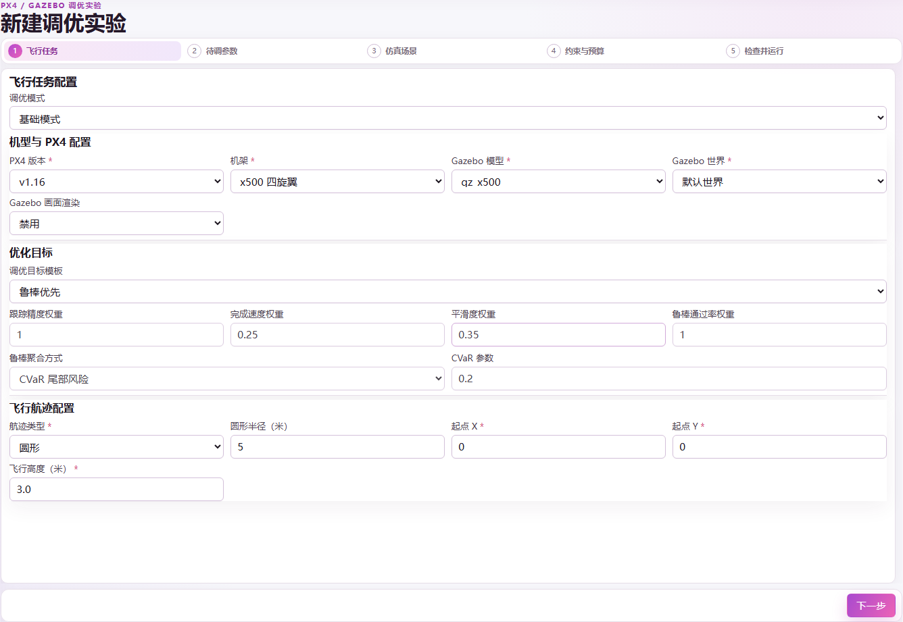
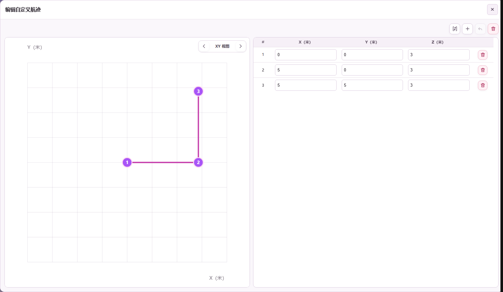
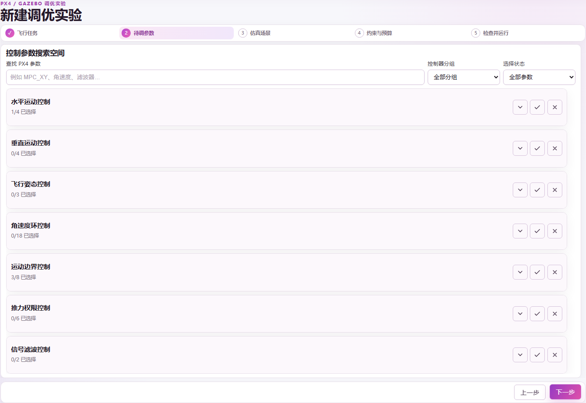
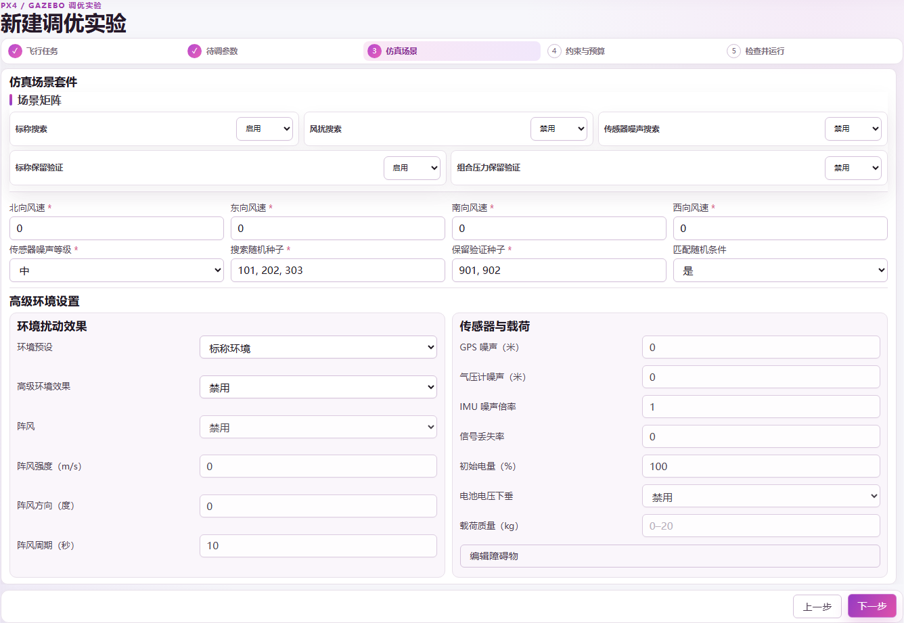
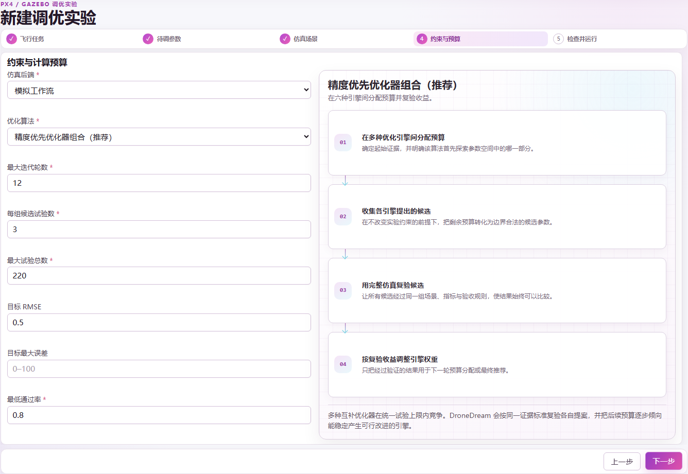
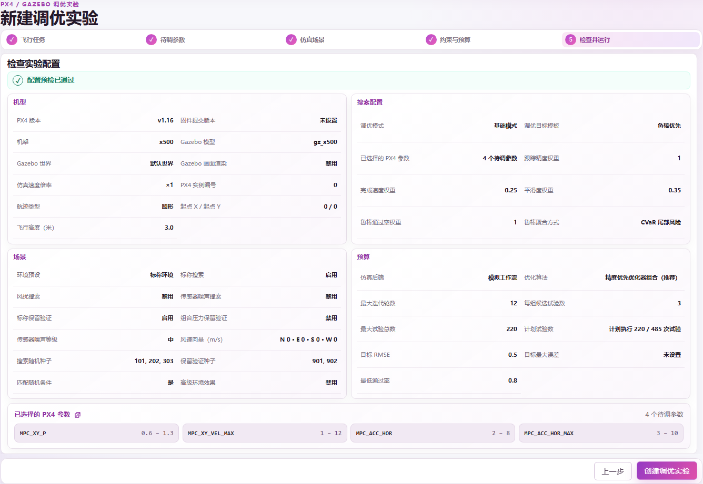
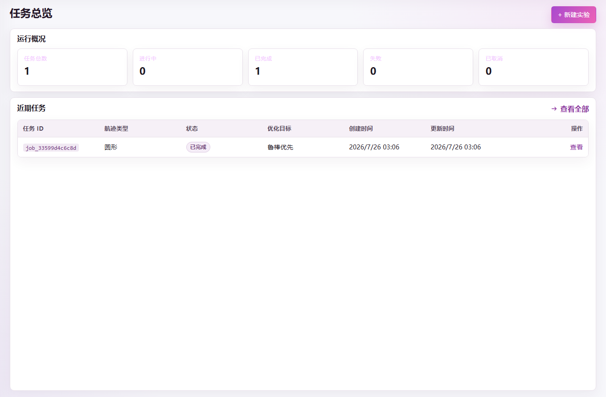
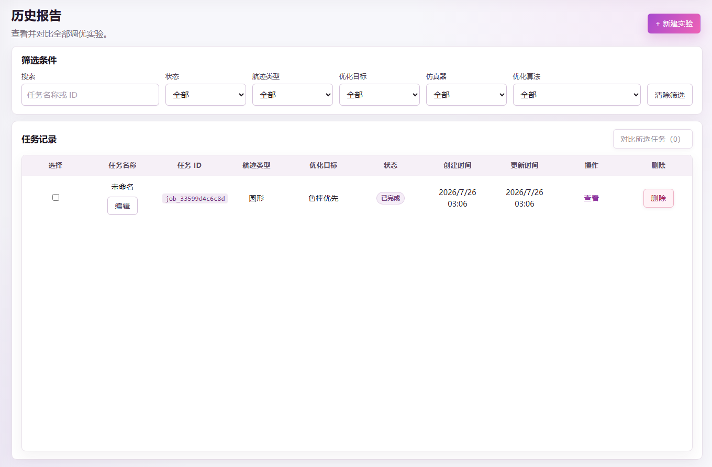

# 关于本说明书

DroneDream 是面向 PX4 与 Gazebo 仿真实验的控制参数调优平台。它把飞行任务、PX4 参数空间、搜索与留出场景、优化策略、试验预算和验收标准组织为一份可以审查、可以复现的实验规格。本说明书严格对应 DroneDream 1.0.0 的当前界面，不仅说明每个控件在哪里，还会解释它改变了什么、什么情况下应该修改、推荐从哪里起步，以及哪一种错误会阻止用户进入下一步。

当你第一次创建研究，或者看到某个参数却不确定怎样填写时，可以直接按照五步向导的章节查找。向导采用“失败即关闭”的校验方式：当前页面没有通过校验时，**下一步**不会放行；只有整个配置重新编译并通过预检后，最终的**创建优化实验**才会生效。表单填写完毕仅表示实验规格完整，并不表示某组参数已经适合真实无人机、其他仿真模型或不同版本的 Runtime。

> **适用边界：** DroneDream 1.0.0 的主体工作是仿真阶段的控制参数调优。Mock 后端产生的是合成流程证据；只有 PX4 / Gazebo 运行时实际启动，并且请求的环境效应、运行身份与产物都通过验证后，结果才能被称为物理仿真证据。

## 字段说明的阅读方式

每个字段都从四个角度说明。**作用**解释它会改变什么；**怎样选择**给出可执行的起点；**默认值**记录 1.0.0 新建草稿时的值；**校验规则**说明什么情况会阻止下一步。仅在高级或专家模式出现的字段会被明确标注，不会让基础模式用户误以为界面缺少内容。

本说明书中的截图来自当前中文界面，截图里的数值只是示例，并不是适用于所有飞行器的推荐值。请先使用一套已经能够在所选模型中稳定完成标称任务的基线，再围绕基线设置保守搜索范围；只有在低维实验得到可复现证据后，才应扩大参数维度或增加环境压力。

# 1. 安装与首次启动

## 1.1 系统与磁盘准备

DroneDream 1.0.0 面向 64 位 Windows 10 和 Windows 11。要运行完整的 PX4 / Gazebo 研究，还需要受所有权约束的 DroneDream Runtime，以及首次启动检查器列出的仿真组件。安装完成与环境就绪是两个不同状态：前者只能证明文件已经写入磁盘，后者还要证明软件能够启动所选流程需要的全部服务、执行文件与运行时组件，不必再补做一次安装配置。

安装前请确认目标磁盘不仅能容纳应用本体，还能容纳 Runtime、仿真镜像、日志和实验产物。启用渲染、截图、轨迹导出或大量留出试验后，证据目录的增长速度会明显高于应用本身。项目目录和证据目录应放在稳定的本地磁盘上，不要放在运行中可能断开的移动存储设备里。

## 1.2 百分之百就绪门控

首次启动时，DroneDream 会检查已安装版本、Runtime 身份、必需执行文件、数据目录写权限、本地端口、后端健康状态和兼容性锚点。只有所有必需检查都进入确定的通过状态，进度条才会达到 100%；随后右上角环境状态变为 **Checked**，进入调优平台的操作才会被启用。该结果会在当前应用会话内复用，普通页面跳转不会重复整套环境检查，除非关键环境发生变化。

如果进度停在 100% 之前，应依据界面显示的具体失败项处理，不要反复重启掩盖问题。Runtime 缺失、执行文件被拦截、端口被占用、目录不可写或组件版本不兼容，都必须在问题源头修复。进入平台后仍可在**设置**中主动执行一次完整环境检查。

## 1.3 重复安装与版本更新

再次运行安装程序时，应让它更新系统中已经登记的 DroneDream，而不是在多个目录制造彼此无关的副本。如果 Windows 的“已安装的应用”里出现多个条目，应保留最新且经过签名或哈希验证的 1.0.0 安装，并通过 Windows 设置卸载旧条目。实验运行期间不要手工删除 Runtime 目录，因为活动 Worker 可能仍持有其中的文件、进程和属于当前安装的任务租约。

下载新构建后，应先将安装包的 SHA-256 与发布页给出的值比较，再打开安装包。哈希一致只能证明下载字节与发布字节一致，不能替代 Windows 代码签名检查。本说明书描述 1.0.0 版本；当前发布的预览候选版本尚未完成 Authenticode 签名。安装包字节一旦变化，后续资产必须使用经批准的新版本、新的版本化文件名、SHA-256 和 `latest.json`，不得覆盖现有版本化 URL。

# 2. 工作区结构

## 2.1 主导航

左侧导航包含**调优对话**、**控制台**、**运行历史**和课程工作区。调优对话把自然语言需求转换成可审查草稿；控制台汇总实验与额度；运行历史提供筛选、比较与证据入口。已经保存的实验名称也会出现在左侧**实验**区域，尚未创建的本地草稿不会自动成为服务器任务。


右上角设置按钮用于切换语言、配置模型访问、查看订阅与额度，以及主动执行环境检查。侧边栏底部的头像用于修改用户名、头像和退出账户。网页版点击 DroneDream 品牌标识会返回公共网站首页；桌面应用保持在软件内部，不执行这一网页跳转。

## 2.2 账户、云端数据与本地草稿

账户身份、用户名、头像、社区帖子、评论、点赞、订阅等级和平台模型额度都存放在云端。因此，只要不同客户端使用同一账户登录，就能看到同一套已经提交到云端的数据。登录 Cookie 仍属于具体域名，在一个网址登录并不会让另一个域名自动登录。

尚未创建的实验草稿采用本地优先保存策略，它只保证在当前客户端恢复，不保证自动同步到另一个浏览器或设备。已经创建的 Job、服务器运行记录、社区内容和账户数据则不同，因为它们已经经过明确提交边界并写入云端。

## 2.3 模型访问方式

DroneDream 提供两种模型访问方式。**平台额度**消耗当前账户等级每月包含的托管额度；**BYOK** 是 Bring Your Own Key 的缩写，表示在包含额度用完之后，由用户提供受支持模型服务商的 API Key。BYOK 密钥只随需要它的提交请求发送，不会从本地草稿中恢复。

不要把 API Key 放到社区帖子、截图、导出配置或客服消息中。如果密钥可能泄露，应立即到对应服务商撤销并重新生成。DroneDream 会在提交前检查服务商、模型名、Base URL 和密钥字段，但 BYOK 的实际计费、速率限制与使用政策仍以服务商为准。

# 3. 两种创建实验的方式

## 3.1 调优对话

当你能够用普通语言描述任务时，调优对话是最快的起点。建议一次写清飞行器、参考轨迹、高度、主要目标、预计扰动、预算和想研究的参数家族。助手可以提出数值、指出缺失信息并生成草稿，但它无权静默创建 Job，也不会在用户审查之前启动仿真器。

一个可审查的请求可以写成：“在 PX4 v1.16 中调优 x500，让它以 3 米高度跟踪半径 5 米的圆形轨迹，优先考虑跟踪与抗风鲁棒性，研究水平位置环参数，保留两个留出种子，总预算不超过 220 个试验。”草稿生成后，仍应进入五步向导逐项复核。

## 3.2 手动创建

当你已经知道实验结构，或者需要精确控制全部字段时，选择**手动创建**。首先输入简短且容易识别的实验名称，例如 `x500-circle-wind-robustness`。名称不能为空，最多 255 个字符，也不要包含密钥或个人敏感信息，因为它会进入运行历史和导出报告。


向导会在本地保存通过校验的进度。**下一步**先校验并保存当前页面，**上一步**恢复此前保存的值。修改早期字段可能使后续字段失效，因此最终检查会重新编译整份实验，而不是沿用旧配置下某个页面留下的局部历史通过状态记录。

# 4. 第一步——飞行任务

飞行任务把研究绑定到具体 PX4 参数目录、飞行器模型、Gazebo 世界、优化目标与参考轨迹。它决定后续哪些参数组合和场景组合具有工程意义。第一次实验应选择能够表达问题的最简单环境，在标称实验稳定后再增加压力条件。



## 4.1 经验等级与飞行器配置

| 字段 | 作用与选择方法 | 默认值 | 校验规则 |
|---|---|---:|---|
| 调优经验等级 | **基础**只展示必要控件；**高级**增加运行与目标细节；**专家**再增加固件提交固定。它只改变界面复杂度，不会自行改变优化器。 | 基础 | 必须是基础、高级或专家。 |
| PX4 版本 | 选择兼容的参数目录与运行契约。应与当前 Runtime 安装的版本一致。 | v1.16 | 必须属于活动目录返回的支持版本。 |
| 固件提交 | 仅专家模式可见。需要精确复现实验时，填写构建 Runtime 所用的 PX4 十六进制提交号；没有提交级固定需求时留空。 | 空 | 非空时必须是 7–40 位十六进制字符。 |
| 飞行器类型 | 指定控制器家族。1.0.0 当前提供多旋翼流程。 | 多旋翼 | 必须与机架和模型兼容。 |
| 机架 | 选择 PX4 Airframe。内置标准四旋翼研究从 x500 开始。 | x500 | 必须属于所选飞行器配置。 |
| Gazebo 模型 | 选择仿真飞行器与传感器载荷。一般从 `gz_x500` 开始，只有研究确实需要时才使用相机、深度、云台或雷达版本。 | gz_x500 | 必须被 Runtime 和机架支持。 |
| Gazebo 世界 | 选择地形与世界资源。普通控制器调优用默认世界；任务需要时再选择 ArUco、Baylands、Ridge、Walls、Windy 或 Moving Platform。 | 默认 | 必须存在于所选 Runtime。 |
| Gazebo 渲染 | 无人值守的数值实验关闭渲染更快；需要目视检查或调试时开启。 | 关闭 | 开启时运行时必须具备渲染能力。 |
| 仿真速度倍数 | 仅高级/专家模式可见。第一次验证保持 1×，确认所选倍速下仍稳定且可复现后再提高。 | 1 | 0.1–100 的有限数值。 |
| PX4 实例 ID | 仅高级/专家模式可见。单机保持 0；并行运行多个 PX4 实例时，每个实例使用不同整数。 | 0 | 0–255 的整数。 |

### 模型变体怎样选择

标准 `gz_x500` 最适合作为起点，因为它减少了与控制问题无关的传感器和插件复杂度。深度或视觉研究可以选择 `gz_x500_depth` 与 `gz_x500_vision`；单目相机方向不同，可在 `gz_x500_mono_cam` 和 `gz_x500_mono_cam_down` 之间选择。

雷达载荷包括向下、向前和二维扫描版本，分别对应 `gz_x500_lidar_down`、`gz_x500_lidar_front` 与 `gz_x500_lidar_2d`；需要云台时选择 `gz_x500_gimbal`。更复杂的模型不会自动提高调优质量，它只会让对应仿真硬件可用。

## 4.2 优化目标与鲁棒聚合

目标配置会把飞行证据转换成优化器可以比较的分数。**稳定性**偏向受控运动，**速度**偏向更短完成时间，**平滑性**惩罚剧烈变化，**鲁棒性**强调跨场景一致性，**自定义**允许高级或专家用户精确设置权重。预设会自动填入权重，但只有在对应经验模式中才允许逐项编辑。

| 字段 | 含义 | 默认值 | 校验与使用建议 |
|---|---|---:|---|
| 跟踪权重 | 参考轨迹跟随的重要程度。空间误差是核心问题时提高。 | 1.00 | 0–100 的有限值。 |
| 速度权重 | 更快完成轨迹的重要程度。在稳定跟踪建立前保持适中。 | 0.25 | 0–100 的有限值。 |
| 平滑权重 | 抑制剧烈控制和运动变化的重要程度。相机平台或柔和轨迹可提高。 | 0.35 | 0–100 的有限值。 |
| 鲁棒权重 | 跨场景表现一致性的重要程度。风、噪声或留出验证研究可提高。 | 1.00 | 0–100 的有限值。 |
| 鲁棒聚合 | **均值**优化平均表现；**最差值**保护最弱场景；**CVaR**强调尾部风险；**分位数**关注指定分位。 | CVaR | 必须选择受支持方法，且至少一个目标权重大于 0。 |
| CVaR α | CVaR 计算所包含的不利尾部比例。更小值更关注极端情况。 | 0.20 | 大于 0 且小于 1，仅 CVaR 使用。 |
| 分位数 | 分位聚合使用的百分数，95 表示更关注高误差结果。 | 95 | 大于 0 且不超过 100，仅分位数使用。 |

不要因为想让每个目标“都重要”就把所有权重同时拉高。权重表达的是目标之间怎样权衡，不能代替硬性合格条件。最大误差、通过率和可行性要求应放在第四步，候选即使综合分数更好，仍可能因为不满足硬约束而被拒绝。

## 4.3 参考轨迹

参考轨迹定义飞行器需要完成的运动。起点 X、起点 Y 和高度决定生成轨迹在世界中的位置。圆形、U 形和八字形容易复现与比较；只有确实需要课程赛道、历史任务或人工设计路径时，才使用自定义参考飞行轨迹配置数据文件。

| 字段 | 作用与选择方法 | 默认值 | 校验规则 |
|---|---|---:|---|
| 轨迹类型 | 选择圆形、U 形、八字形或自定义。第一次受控实验优先使用内置轨迹。 | 圆形 | 必须是受支持类型。 |
| 圆形半径 | 生成圆的半径。增大半径会降低曲率要求，减小半径会增强横向跟踪压力。 | 5 m | 大于 0 且不超过 100 m。 |
| U 形直线长度 | 转弯前后直线段长度。 | 10 m | 大于 0 且不超过 200 m。 |
| U 形转弯半径 | U 形转弯曲率。越小越考验横向响应。 | 3 m | 大于 0 且不超过 100 m。 |
| 八字尺度 | 八字形总体尺度。越小，弯曲和交叉频率越高。 | 4 m | 大于 0 且不超过 100 m。 |
| 起点 X / 起点 Y | 生成轨迹的水平坐标偏移。没有障碍物、地图或多机规划要求时保持 0,0。 | 0 m / 0 m | 两个值都必须是有限数。 |
| 高度 | 生成轨迹的参考高度。需要避开地形和模型出生约束。 | 3.0 m | 1–20 m。 |
| 自定义航点 | 由 X、Y 和可选 Z 坐标组成的有序 JSON 列表。优先使用编辑器，只有导入已知路径时才直接使用 JSON。 | 无 | 至少两个点；X、Y 必须有限；Z 存在时必须有限；序列化大小不得超过编辑器上限。 |

### 自定义轨迹编辑器

编辑器支持 XY、XZ、YZ 和 3D 视图，支持添加、删除、撤销和清空航点，也支持数值坐标编辑、图表与表格联动、JSON 导入和导出。内置轨迹可以先转换成可编辑航点，再做少量课程化修改，这通常比从空白画布开始更可靠。



可导入下面这种坐标对象数组：

```json
[
  {"x": 0.0, "y": 0.0, "z": 3.0},
  {"x": 5.0, "y": 0.0, "z": 3.0},
  {"x": 5.0, "y": 5.0, "z": 3.0}
]
```

导入后应检查点的顺序、高度和图形是否符合预期。两个点足以通过最低校验，但通常不足以构成有价值的闭合飞行研究。应避免连续重复点、不可实现的尖角、超出所选 Gazebo 世界范围的坐标，以及要求飞行器瞬间改变速度的线段。

# 5. 第二步——待调参数

第二步精确定义优化器被允许改变哪些 PX4 参数。目录会随版本切换，并按控制器区域分组。参数越多，搜索表达能力越强，搜索空间也越大；第一次研究应只选择能够解释当前现象的最小控制环，并把无关控制环冻结在已记录的基线上。



## 5.1 怎样阅读一行参数

每行目录会展示 PX4 变量名、中文解释、基线、搜索下限、搜索上限、尺度、相关参数、风险提示与应用或重启策略。只有选中复选框，优化器才获得修改该参数的权限；未选中参数只是供用户查阅，不会增加搜索维度或消耗候选预算。

| 控件 | 它表示什么 | 怎样填写 |
|---|---|---|
| 已选 | 授权优化器为该参数提出候选值。 | 至少选择 1 个，最多 64 个；第一次从一个控制家族开始。 |
| 基线 | 当前已知起点，也是对照候选。 | 使用已经能完成标称飞行、且没有关键失败的值。 |
| 搜索下限 | 任意候选允许使用的最低值。 | 必须在目录硬范围内，最好先落在保守起步范围内。 |
| 搜索上限 | 任意候选允许使用的最高值。 | 必须大于下限，并保持在目录硬范围内。 |
| 线性尺度 | 按相同绝对间隔采样。 | 参数的加法变化具有可比意义时使用。 |
| 对数尺度 | 按相同倍数间隔采样。 | 只适合严格为正、跨数量级的范围；下限必须大于 0。 |
| 相关参数 | 提示控制器耦合或需要成对审查的轴。 | 单独放宽一个轴之前先检查关联参数。 |
| 重启/应用策略 | 说明参数是否需要 PX4 重启或特殊应用边界。 | 在最终检查中保留提示，并把重启成本计入运行计划。 |

校验器要求基线与上下界都是有限数，满足“下限 < 上限”，基线位于搜索范围内，且搜索范围不超过目录硬边界。整数或枚举参数的基线与边界都必须为整数。没有选中参数、选中超过 64 个参数、或者对数尺度下限小于等于 0，都会阻止进入下一步。

## 5.2 推荐的递进方式

针对水平轨迹误差，可以从 `MPC_XY_P`、`MPC_XY_VEL_MAX`、`MPC_ACC_HOR` 和 `MPC_ACC_HOR_MAX` 开始。如果证据显示问题来自速度环阻尼，而不是位置环，再在后续独立实验中加入 `MPC_XY_VEL_P_ACC`、`MPC_XY_VEL_I_ACC` 或 `MPC_XY_VEL_D_ACC`。高度问题使用 `MPC_Z_*` 家族，机体姿态或角速度振荡使用 `MC_*` 姿态与速率环。

第一次运行不要同时调位置、速度、姿态、角速度、推力和滤波参数。高维宽范围实验容易拟合噪声，难以定位改进来自哪个控制环，也可能在获得充分留出证据之前耗尽预算。只有上一轮报告已经给出稳定、可重复、没有未解释失败的证据时，才应扩大参数空间。

## 5.3 核心 PX4 参数目录

活动后端返回的目录具有最终权威，兼容服务器可能提供更多条目。下表记录 1.0.0 前端内置核心子集的默认值、硬范围和保守起步范围，便于用户在不知道怎样设边界时快速查阅并建立第一组可以复现、比较和独立审查的配置。

| 参数 | 控制作用 | 默认值 | 硬范围 | 保守起步范围 |
|---|---|---:|---:|---:|
| `MPC_XY_P` | 水平位置比例增益 | 0.95 | 0–2 | 0.60–1.30 |
| `MPC_XY_VEL_P_ACC` | 水平速度比例增益 | 1.80 | 1.2–5 | 1.2–2.8 |
| `MPC_XY_VEL_I_ACC` | 水平速度积分增益 | 0.40 | 0–60 | 0.10–1.00 |
| `MPC_XY_VEL_D_ACC` | 水平速度微分增益 | 0.20 | 0.1–2 | 0.10–0.50 |
| `MPC_Z_P` | 垂直位置比例增益 | 1.00 | 0.1–1.5 | 0.60–1.30 |
| `MPC_Z_VEL_P_ACC` | 垂直速度比例增益 | 4.00 | 2–15 | 2.5–8 |
| `MPC_Z_VEL_I_ACC` | 垂直速度积分增益 | 2.00 | 0.2–3 | 0.5–2.5 |
| `MPC_Z_VEL_D_ACC` | 垂直速度微分增益 | 0.00 | 0–2 | 0–0.50 |
| `MC_ROLL_P` | 横滚姿态比例增益 | 4.00 | 0–12 | 2–8 |
| `MC_PITCH_P` | 俯仰姿态比例增益 | 4.00 | 0–12 | 2–8 |
| `MC_YAW_P` | 偏航姿态比例增益 | 2.80 | 0–5 | 1–4 |
| `MC_ROLLRATE_P` | 横滚角速度比例增益 | 0.15 | 0.01–0.50 | 0.08–0.25 |
| `MC_ROLLRATE_I` | 横滚角速度积分增益 | 0.20 | 0–1 | 0.05–0.40 |
| `MC_ROLLRATE_D` | 横滚角速度微分增益 | 0.003 | 0–0.01 | 0.001–0.006 |
| `MC_PITCHRATE_P` | 俯仰角速度比例增益 | 0.15 | 0.01–0.60 | 0.08–0.30 |
| `MC_PITCHRATE_I` | 俯仰角速度积分增益 | 0.20 | 0–1 | 0.05–0.40 |
| `MC_PITCHRATE_D` | 俯仰角速度微分增益 | 0.003 | 0–0.01 | 0.001–0.006 |
| `MC_YAWRATE_P` | 偏航角速度比例增益 | 0.20 | 0–0.60 | 0.05–0.35 |
| `MC_YAWRATE_I` | 偏航角速度积分增益 | 0.10 | 0–0.50 | 0.02–0.25 |
| `MPC_XY_VEL_MAX` | 最大水平速度 | 12 m/s | 0–20 | 1–12 |
| `MPC_Z_VEL_MAX_UP` | 最大上升速度 | 3 m/s | 0.5–8 | 1–5 |
| `MPC_Z_VEL_MAX_DN` | 最大下降速度 | 1.5 m/s | 0.5–4 | 0.5–2.5 |
| `MPC_ACC_HOR` | 标称水平加速度 | 3 m/s² | 2–15 | 2–8 |
| `MPC_ACC_HOR_MAX` | 最大水平加速度 | 5 m/s² | 2–15 | 3–10 |
| `MPC_JERK_AUTO` | 自动模式加加速度限制 | 4 m/s³ | 1–80 | 2–20 |
| `MPC_TILTMAX_AIR` | 空中最大倾角 | 45° | 20–89 | 25–60 |
| `MPC_THR_MIN` | 最小归一化推力 | 0.12 | 0.05–0.50 | 0.08–0.25 |
| `MPC_THR_HOVER` | 悬停归一化推力 | 0.50 | 0.10–0.80 | 0.25–0.60 |
| `MPC_THR_MAX` | 最大归一化推力 | 1.00 | 0–1 | 0.60–1.00 |
| `MC_AIRMODE` | 空中模式枚举：关闭、横滚/俯仰、横滚/俯仰/偏航 | 0 | 0–2 | 0–2 |
| `IMU_GYRO_CUTOFF` | 陀螺仪低通截止频率，需要重启 | 40 Hz | 0–1000 | 20–80 |

硬范围只表示“该目录允许提交”，不表示“对所有飞行器都安全”。保守起步范围也只是软件护栏。飞行器质量、惯量、执行器能力、传感器延迟和仿真保真度都会影响某个具体数值是否合理，因此每次研究都必须保留适用模型与版本信息。

# 6. 第三步——仿真场景

场景决定候选在哪些条件下学习，又在哪些未见条件下接受检验。**搜索**场景可以影响优化器，**留出**场景只用于最终验收，不能泄漏进候选选择。启用共同随机数后，不同候选会面对同一组种子控制的扰动，从而在匹配条件下完成公平比较。



## 6.1 场景矩阵与种子

| 字段 | 作用与选择方法 | 默认值 | 校验规则 |
|---|---|---:|---|
| 标称搜索 | 在没有额外风或噪声压力时评估候选，建议保留为稳定参照。 | 开启 | 至少开启一个搜索场景。 |
| 风场搜索 | 优化期间施加方向风。只有 Runtime 能证明风场已经生效时才开启。 | 关闭 | Worker 必须报告请求效应已经物理应用。 |
| 噪声搜索 | 使用所选传感器噪声配置评估候选。 | 关闭 | Worker 必须报告请求效应已经物理应用。 |
| 标称留出 | 在未见标称种子上测试最终候选。 | 开启 | 任何留出场景开启时都必须填写留出种子。 |
| 组合压力留出 | 在未见组合压力矩阵中验收，适合在单项效应验证后使用。 | 关闭 | 每项请求效应都需要 Runtime 证明。 |
| 搜索种子 | 候选搜索阶段使用的可复现随机种子。 | 101, 202, 303 | 1–100 个互不重复的非负整数。 |
| 留出种子 | 完全排除在优化之外，只用于最终验收。 | 901, 902 | 非负整数，不能与搜索种子重叠。 |
| 共同随机数 | 对候选复用相同种子矩阵，降低比较噪声。 | 开启 | 布尔值，受控比较时强烈建议开启。 |

种子可使用逗号或空格分隔。重复值会被归一化，但搜索集合与留出集合必须完全分离。增加种子能改善不确定性估计，同时会成倍增加试验数量，因此应同步提高硬预算，不能假设规划器会自动接受、压缩或填充不完整矩阵。

## 6.2 风向与传感器噪声

北、东、南、西四个风场字段允许 −10 至 10 m/s。正负方向按 Runtime 契约解释，不要把同一个绝对风速同时填进四个方向。传感器噪声提供低、中、高三个定性等级。第一次运行应先保留标称配置，之后一次只增加一个扰动家族，避免失败原因无法归因。

## 6.3 高级环境设置

高级面板提供标称、风/阵风、传感器退化与组合压力预设，同时允许直接编辑各项效应。预设只是批量填写相关字段，不会绕过校验；关闭面板之前仍需检查它生成的每个数值、计量单位以及对应的 Runtime 实际支持状态。

| 字段 | 作用 | 有效范围 |
|---|---|---:|
| 启用阵风 | 把周期阵风请求写入场景契约。 | 布尔值 |
| 阵风强度 | 请求的阵风速度，起步时应低于持续风包络。 | 0–30 m/s |
| 阵风方向 | 以角度表示方向。 | 大于等于 0 且小于 360 |
| 阵风周期 | 相邻阵风周期之间的时间。 | 大于 0 且不超过 300 s |
| GPS 噪声 | 由受支持插件施加的位置噪声幅度。 | 0–100 m |
| 气压计噪声 | 由受支持插件施加的高度噪声幅度。 | 0–100 m |
| IMU 噪声倍数 | 受支持惯性噪声模型的倍数。 | 0–10 |
| 信号丢失率 | 受支持效应模型丢弃的样本比例。 | 0–1 |
| 初始电量 | 场景开始时的电池状态。 | 0–100% |
| 电压下陷 | 请求场景内的电压下陷效应。 | 布尔值 |
| 载荷质量 | 飞行器附加质量；不需要载荷时留空。 | 空或 0–20 kg |
| 障碍物 JSON | 注入受支持世界的静态圆柱体或长方体。 | JSON 数组，最多 100 项 |

障碍物可以写成：

```json
[
  {"type": "cylinder", "x": 8, "y": 1, "radius": 0.7, "height": 4},
  {"type": "box", "x": 12, "y": -2, "size_x": 2, "size_y": 1, "height": 3}
]
```

所有坐标都必须是有限数，半径、尺寸和高度都必须为正。1.0.0 内置 Runner 当前能够证明静态圆柱和长方体已经注入；风/阵风、GPS 或传感器退化、电池、载荷与执行器延迟依赖兼容的 Runtime 扩展及效应回读。Worker 无法证明请求效应生效时，真实运行会被拒绝，DroneDream 不会把标称物理过程错误标成一次成功完成并经过验证的环境压力测试。

# 7. 第四步——约束与预算

第四步选择执行后端、优化算法、试验计划、验收阈值和模型访问路径。预算是硬上限，不是大致估计。规划器只安排完整的“候选 × 场景”组合，并在下一组会超过总上限之前停止，即使名义迭代次数仍未耗尽也不会破坏矩阵完整性。



## 7.1 仿真后端

**Mock** 使用确定性的合成结果验证界面、流程、数据模型和报告路径，不会启动 PX4 / Gazebo，也不能当作飞行性能证据。**PX4 / Gazebo** 执行真实仿真路径，只有能力检查确认 Runtime 就绪后才可选择。执行文件缺失、Runtime 不兼容或请求效应不可用都会让该后端保持阻断。

可以用 Mock 低成本学习界面或检查草稿；需要解释性能时，必须在 PX4 / Gazebo 上重新运行，并验证产物、仿真身份、种子来源和环境效应。推荐参数的可信度不会高于生成它的后端证据、测量契约、Runtime 身份与可复现产物。

## 7.2 优化器怎样选择

| 优化器 | 适用场景 | 重要边界 |
|---|---|---|
| 精度优先优化器组合 | 推荐的通用选择。六种互补引擎共享总预算，后续预算逐步倾向能够产生可复现可行收益的引擎。 | 需要足够预算公平比较多种引擎。 |
| 大模型工具编排 Harness | 模型读取压缩证据包，从封闭工具注册表中选择可信优化器，本地校验器始终掌握执行权。 | 需要模型访问；无效决策会确定性回退。 |
| 失败感知约束多目标贝叶斯优化 | 多目标、坠机、超时或硬可行性约束并存的研究。 | 需要足够的成功与失败观察来建模可行性。 |
| 多保真约束多目标贝叶斯优化 | 同时具备有效低成本筛选和完整验证层级的研究。 | 筛选证据不能代替最终 PX4 / Gazebo 验证。 |
| TuRBO 启发式信赖域贝叶斯优化 | 参数耦合明显，预计有效改进靠近当前最优点。 | 起始区域选错时可能错过远处优良区域。 |
| SAAS 启发式约束贝叶斯优化 | 维度较高，但预期只有少数参数轴真正主导表现。 | 仍需严格边界与足够证据。 |
| 代理模型辅助 CMA-ES | 仿真昂贵，需要先用代理模型筛选种群。 | 代理预测未经真实评估不能通过验收。 |
| BIPOP 启发式 CMA-ES | 多峰空间，需要交替重启规模跳出局部最优。 | 重启探索会明显消耗预算。 |
| CMA-ES | 连续参数基线和兼容性比较。 | 不使用模型推理，对离散结构支持有限。 |
| GPT 提案模式 | 用于兼容研究的直接模型候选提案。 | 需要模型访问，全部提案仍受本地校验。 |
| 启发式 | 低成本、确定性的扰动基线。 | 可作为基线，不能声称全局最优。 |
| 不使用优化器 | 只把锁定基线运行一遍完整场景矩阵。 | 不发生调优，用于建立参照证据。 |

优化器从不拥有无限制的执行权限。候选必须通过冻结参数空间、试验预算、场景矩阵和验收契约编译。不可用工具、畸形模型决策、越界数值或过期证据都会被明确记录，并被拒绝或转入结果确定、来源完整且可审计的回退路径。

## 7.3 计划与验收字段

| 字段 | 作用与选择方法 | 默认值 | 校验规则 |
|---|---|---:|---|
| 最大迭代数 | 优化器最多更新多少代。只有预算和场景矩阵能够承载时才提高。 | 12 | 1–100 的整数。 |
| 每个候选试验数 | 兼容旧 Worker 和简单计划的重复次数。 | 3 | 1–10 的整数。 |
| 最大总试验数 | 覆盖基线、搜索、失败与已计划试验的硬上限，是主要成本护栏。 | 220 | 1–10,000 的整数，并且足以容纳最低完整计划。 |
| 目标 RMSE | 可选的跟踪误差验收阈值。 | 0.5 | 空或 0–100 的有限值。 |
| 目标最大误差 | 对最差空间误差的可选上限。 | 空 | 空或 0–100 的有限值。 |
| 最低通过率 | 场景试验必须通过验收的比例。 | 0.8 | 0–1 的有限值。 |

如果界面提示预算太小，不要只多加一个试验。应计算启用的搜索场景、搜索种子、重复次数、基线评估和候选组，再选择能够容纳完整组合的上限。DroneDream 会主动拒绝不完整矩阵，因为让一个候选少跑场景、另一个候选多跑场景会破坏比较公平性。

## 7.4 平台额度与 BYOK

所选账户等级仍有托管额度时，平台额度是默认模型路径。额度用完，或者用户明确选择自有服务商时，可以切换 BYOK。需要模型的优化器在两条路径都没有有效凭据、可达模型与受支持的服务访问契约时会被明确阻断执行。

| BYOK 字段 | 填写要求 |
|---|---|
| 服务商 | 按密钥签发方选择 OpenAI、Qwen、DeepSeek 或 Custom。 |
| API Key | BYOK 模式必填，最多 512 个字符；不会从本地草稿恢复。 |
| 模型 | 非 OpenAI 服务商必填，最多 128 个字符；使用服务商接受的模型标识。 |
| Base URL | 非 OpenAI 服务商必填。必须是带主机名的 HTTP/HTTPS 地址，不能含账号密码、查询串或片段，最长 2,048 个字符。 |

软件会展示已用和剩余额度，但 BYOK 的计费仍以服务商记录为准。不要把浏览器登录密码、Supabase Key、Service Role Secret 或其他无关云凭据填进 API Key 字段，否则既不安全，也无法形成有效且可审计的模型访问请求。

# 8. 第五步——检查并运行

第五步是整份研究的编译预检，会汇总飞行器与运行时身份、目标与聚合、参数范围、场景与种子隔离、优化器、后端、计划预算、验收标准和模型访问。绿色的**配置预检已通过**只表示提交规格内部一致，不表示未来仿真一定成功。



打开已选参数详情，逐项检查基线和上下界；确认留出场景从未参与搜索、硬预算可以接受、后端与报告声明一致，并且所有高级效应都受到 Runtime 支持。出现问题时，可以通过问题链接直接返回对应字段；修改后仍需重新向前继续，让后续依赖再次通过校验。

只有**创建优化实验**会跨越 Job 创建边界。调优对话、草稿自动保存、步骤切换和最终检查都不会启动仿真器。创建后，Worker 会领取试验租约、应用受围栏保护的候选、启动后端、验证产物、聚合场景证据，再请求下一组候选。取消、过期 Worker 或租约丢失都不能把胜出结果写入正式实验记录、比较集合、证据账本、验收结论、发布候选或最终生成的实验报告。

# 9. 监控、比较与解释结果

## 9.1 控制台

控制台汇总实验数量与最近活动，可用来确认 Job 已经创建、识别仍在运行的工作并进入详细证据页。只存在于当前浏览器的草稿，在跨越明确创建边界并获得可以持久查询和定位的服务器端 Job ID 之前不会自动出现在这里显示。



## 9.2 运行历史

运行历史可以按名称或 ID、状态、轨迹类型、目标、仿真器和优化器筛选。勾选兼容 Job 后再点击**比较所选**。只有飞行器、参数、目标、场景和证据契约彼此兼容时，比较才有工程意义；配置不匹配时界面会阻止操作或给出明确警告。



删除 Job 属于破坏性操作，应在导出必需报告和产物后执行。删除本地草稿与删除服务器 Job 是两件不同的事。删除前应确认 Job ID、报告、证据账本和复现包已经按照项目的证据保留政策与完整复现审计要求妥善归档保存。

## 9.3 Job 证据怎样阅读

Job 详情会分开显示 Worker 状态、心跳与取消、候选历史、逐场景试验、轨迹回放、验收与留出、优化器来源以及可下载产物。应按这个顺序阅读：先确认正确后端与请求效应确实运行，再比较性能指标，最后才解释推荐参数。

常见终止结果包括成功、达到最大迭代、没有可用候选、仿真器不可用，以及场景或结果契约失败。失败试验只有在失败分类和产物可信时才是数据。基础设施故障、产物缺失或效应未证明，不能被误解为某片参数区域在物理上不好。

## 9.4 报告与水印

每个完成的研究都可以导出报告，内容包括配置、候选代次、逐次试验结果、反馈、参数变化、验收、留出证据与复现标识。Free 用户导出的 PDF 带 DroneDream 验证水印，Plus 与 Pro 用户导出无水印。水印表示报告等级，并不证明推荐参数可以安全用于真实飞行器。

每份报告都应连同源 Job ID 和证据哈希保存。软件更新后重新生成报告时，应比较来源提交与证据标识，不能因为两份 PDF 看起来相似就假设它们描述了完全相同的实验配置、Runtime 身份、随机种子、仿真产物与来源证据。

# 10. 退出、恢复与安全中断

有未完成草稿时关闭 DroneDream，软件会弹出提醒并尽力在当前客户端保留草稿。有仿真正在运行时关闭软件，可能中断本地 Worker；条件允许时应先使用 Job 取消操作，让服务器记录明确终止状态。即使草稿保存或取消发生错误，右上角关闭按钮仍必须允许用户顺利退出。

异常关闭后重新打开软件，应先等待环境门控结束，再检查运行历史。服务器 Job 可能已经完成、取消、租约过期或等待恢复，直接新建重复实验会浪费预算，也会制造来源、时间、随机种子、配置版本与所有权难以区分的重复证据。

# 11. 常见问题

## 11.1 “下一步”无法点击

先查看当前页面最靠前的字段错误。常见原因包括实验名称为空、PX4 版本不支持、固件提交格式错误、全部目标权重为 0、轨迹几何无效、没有选择参数、边界超过目录、搜索与留出种子重叠、没有开启搜索场景、总试验数小于最低完整计划，或者后端/模型能力尚未就绪。

如果修改前面页面后，错误出现在后续字段，应继续沿向导修正依赖值。最终编译器会重新检查全部草稿，因为原来有效的优化器、参数集或预算可能已经不再适合新的飞行器、Runtime、目标、场景矩阵或最终提交证据契约。

## 11.2 PX4 / Gazebo 不可选择

打开设置并主动运行环境检查，核对 Runtime 所有权、执行文件路径、版本锚点、目录写权限、本地端口和后端健康状态。如果报告要被称为物理仿真证据，不要为了消除错误而切换 Mock；Mock 只能证明应用流程和数据通路。

## 11.3 高级环境效应被拒绝

当前 Runtime 没有为该效应提供可验证的启动器或回读契约。可以移除该效应运行标称研究，或者安装兼容扩展后重新执行能力检查。内置 Runner 可以证明静态长方体与圆柱体障碍物，其余高级效应取决于 Runtime 支持及明确的效应回读。

## 11.4 摄像头无法使用

拍照需要 HTTPS 或 localhost 这类安全上下文，同时需要 Windows 权限、浏览器站点权限和可用摄像头。直接使用 HTTP IP 地址即使点击允许，也可能因为不属于安全上下文而被拒绝。请使用 HTTPS 公共网站或桌面应用，并检查 Windows 的“隐私和安全性 → 摄像头”、浏览器地址栏权限图标、当前选择的摄像头设备，以及其他应用是否正在持有摄像头独占锁。

## 11.5 模型优化器不可用

检查托管额度、订阅等级、服务商与 BYOK 字段。Base URL 必须是干净的 HTTP/HTTPS 地址，不能嵌入账号密码、查询参数或片段。如果模型路径仍不可用，可以选择确定性的精度优先优化器组合；Job 不应通过未验证的模型路径继续。

## 11.6 分数变好但没有通过验收

优化目标与验收契约回答的是不同问题。候选可以改善加权综合分数，同时仍违反最大误差、通过率、可行性或留出要求。应查看逐场景结果与失败分类，再判断候选确实不合格，还是原验收阈值没有准确表达真正的工程需求。

# 12. 第一次实验检查表

1. 确认就绪进度达到 100%，右上角环境状态显示 **Checked**。
2. 使用容易识别的实验名称，并选择 Runtime 已安装的 PX4 版本。
3. 从 `gz_x500`、默认世界、关闭渲染和 1× 仿真速度开始。
4. 导入自定义几何之前，先使用内置轨迹和已知能够飞行的基线。
5. 第一次只选择一个控制家族，边界保持在目录保守范围内。
6. 开启标称搜索和标称留出，使用互不重叠的种子，并开启共同随机数。
7. Mock 只用于流程演练；物理仿真证据必须来自通过验证的 PX4 / Gazebo。
8. 没有明确方法学原因时，优先选择精度优先优化器组合。
9. 硬试验上限必须能够容纳完整的候选 × 场景组合。
10. 创建前逐块检查最终预检，完成后导出报告并保存证据标识。

# 附录 A——常见研究模板

## A.1 水平圆形轨迹调优

选择 `gz_x500`、默认世界、3 米高度和 5 米半径圆形轨迹，目标使用鲁棒性。先选择 `MPC_XY_P`、`MPC_XY_VEL_MAX`、`MPC_ACC_HOR` 与 `MPC_ACC_HOR_MAX`，启用标称搜索和标称留出，并保持种子分离。加入风场搜索或组合留出之前，先建立 PX4 / Gazebo 基线。

## A.2 高度超调诊断

使用包含爬升或垂直转换的轨迹，把参数限制在 `MPC_Z_P`、`MPC_Z_VEL_P_ACC`、`MPC_Z_VEL_I_ACC` 和 `MPC_Z_VEL_D_ACC`。提高跟踪与平滑权重，记录最大高度误差，并查看轨迹回放，不要只依赖单一聚合 RMSE 判断优劣。

## A.3 姿态或角速度振荡

第一次研究只选择姿态增益（`MC_ROLL_P`、`MC_PITCH_P`、`MC_YAW_P`）或某一个角速度家族。使用保守边界和对平滑性敏感的目标，在可用时保留高频证据。振荡来源没有被隔离之前，不要同时放宽推力、滤波、位置和角速度空间。

# 附录 B——提交支持材料

请求技术支持时，应导出或记录应用版本、Runtime 版本、Job ID、后端、PX4 版本与提交、仿真模型与世界、参数范围、优化器、场景种子、终止结果、失败代码和证据哈希。截图之前应检查其中不含 API Key、邮箱、私有地址或其他秘密。

需要复现审查时，还应保存实验 JSON、自定义轨迹 JSON、障碍物 JSON、生成报告、关键产物和安装包 SHA-256。信息完整且结构清晰的支持包，比缺少原始配置、Runtime 身份、仿真器构建或随机种子的长篇问题描述更有价值。

# 附录 C——校验范围速查

| 区域 | 可接受值 | 出现以下情况时配置会被阻断 |
|---|---|---|
| 实验身份 | 名称长度 1–255 个字符 | 名称为空或超过 255 个字符。 |
| PX4 身份 | 受支持目录版本；可选 7–40 位十六进制提交 | 版本不受支持，或提交号含非十六进制字符。 |
| 运行控制 | 倍速 0.1–100；实例 ID 为 0–255 的整数 | 数值缺失、不是有限数、整数项出现小数或超出范围。 |
| 优化目标 | 四项权重 0–100；CVaR α 在 0 与 1 之间；分位数大于 0 且不超过 100 | 全部权重为 0、聚合方式不受支持或对应条件值无效。 |
| 轨迹 | 自定义至少两个点；高度 1–20 m；内置轨迹尺寸符合本章上限 | 坐标不是有限数、几何为空或尺寸越界。 |
| 待调参数 | 选择 1–64 个；基线与边界有限；下限小于上限；基线位于范围内 | 超过目录硬边界、整数参数出现小数，或对数下限不为正。 |
| 种子与场景 | 1–100 个唯一非负种子；至少一个搜索场景；搜索与留出完全分离 | 搜索为空、启用留出却没有种子，或两个集合存在同一数值。 |
| 高级环境 | 使用本章数值范围；障碍物为有效长方体或圆柱体；最多 100 个 | JSON 无效、尺寸不为正，或 Runtime 无法证明请求效应已经生效。 |
| 预算 | 迭代 1–100；重复 1–10；总试验 1–10,000；通过率 0–1 | 硬上限无法容纳最低完整的候选 × 场景计划。 |
| BYOK | Key 最长 512；模型名最长 128；Base URL 最长 2,048 且为干净 HTTP/HTTPS 地址 | 必填项缺失，或地址包含凭据、查询串、片段或缺少主机名。 |

本附录用于快速定位问题，不能替代第一步至第四步的字段说明。多个字段同时无效时，DroneDream 会先指向最早的阻断项；修正后应继续向前，让完整编译器再次检查后续字段的所有依赖关系、兼容性与实际可用执行能力。

<!-- manual-pdf-pagebreak -->

# 附录 D——术语表

| 术语 | 在 DroneDream 中的含义 |
|---|---|
| 基线 | 已知且锁定的起始参数组，所有候选证据都以它为参照。 |
| 候选 | 在冻结边界内提出的一组参数，需要经过完整搜索或验证矩阵评估。 |
| 场景 | 世界、扰动、物理效应与种子控制随机性的可复现组合。 |
| 搜索集 / 留出集 | 搜索证据可以影响候选选择；留出证据只用于最终验收，不能进入优化。 |
| 试验 | 某个候选在一个具体场景与种子下的单次评估，会产生指标和产物。 |
| AURORA Harness | DroneDream 用于编译上下文、选择可信工具、校验动作、解释反馈并保存决策来源的受约束编排框架。 |

界面、API 记录、报告和本说明书都按上述含义使用这些词。分析结果时，应把候选级聚合与支撑它的逐次试验分开，也要始终保持搜索证据和最终留出验收数据在候选选择、比较、报告、发布与最终验收决策流程中彼此隔离。
